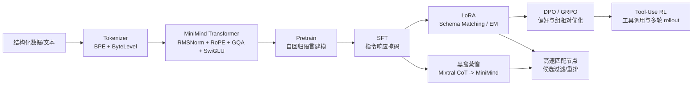

# Tiny-Tabular-LLM 面试速记版

> 用途：面试前 10-15 分钟快速复盘。完整解释看 `Tiny_Tabular_LLM_面试准备.md` 和 `experiments/interview_docs/00_stage*.md`。

---

## 1. 一句话介绍

我基于 MiniMind 从零搭建了一个面向结构化数据匹配的轻量级 LLM 全链路训练框架，把 Tokenizer、Transformer、预训练、SFT、LoRA、DPO/GRPO、Tool-Use RL 和黑盒蒸馏都跑通，并针对表格 Schema Matching 场景做了 Attention Residuals、类别不平衡处理和多任务 LoRA 微调等实验。

---

## 2. 30 秒版本

这个项目的背景是：在多智能体表格检索/匹配系统里，如果一直调用大模型做 MatcherAgent，成本和延迟都很高。所以我尝试训练一个 64M 左右的小模型，作为高吞吐的结构化匹配节点。

我主要做了四件事：

1. 吃透并改造 MiniMind 底座，包括 RoPE、SwiGLU、GQA、KV-Cache 和训练基础设施。
2. 针对结构化数据设计 JSON 指令格式，用 LoRA 做 Schema Matching，并解决 99.7% 负样本导致的模式坍塌。
3. 跑通 DPO、GRPO、Tool-Use/Agentic RL，验证小模型在 RL 对齐上的收益和瓶颈。
4. 做了 Mixtral-8x7B 到 MiniMind-64M 的黑盒 CoT 蒸馏，验证速度收益，也发现类别偏差会被蒸馏继承。

最终结论不是“小模型全面替代大模型”，而是：小模型适合作为高速候选过滤/重排节点，再配合大模型兜底。

---

## 3. 2 分钟版本

项目叫 Tiny-Tabular-LLM，目标是在结构化数据匹配场景里，用一个 64M 级别的小语言模型降低多智能体系统的推理成本和延迟。

技术上，我从 MiniMind 框架出发，完整走了一遍 LLM 训练链路。底座部分，我重点理解并实现了 Transformer 的核心组件：Tokenizer 负责把文本变成 token ids；模型里使用 RMSNorm、RoPE、GQA、SwiGLU、KV-Cache；训练部分支持 DDP、AMP、断点续训和余弦学习率调度。

在模型结构上，我做了一个 Attention Residuals 改造。标准 PreNorm Transformer 的残差只连接上一层 hidden state，而我改成在 attention 残差分支里对历史层 hidden states 做可学习 softmax 加权。这样每一层都能直接参考更早层的表示，给梯度传播提供更多短路径。实验上 hidden norm 的 CV 从 0.368 降到 0.153，loss 在同等算力下降低约 0.9%。

任务适配上，我把二维表头结构序列化成 JSON 指令，用 LoRA 做 Schema Matching。最关键的问题是数据极度不平衡，正例只有约 0.3%，模型直接学会全预测 No。我的解决方案是构造 1:1 平衡数据，并引入 SM+EM 多任务联合训练，让模型从 Entity Matching 迁移到稀少正例匹配特征。平衡集上的 Precision 从 0.50 提升到 0.905。

后训练方面，我跑通了 DPO、PPO/GRPO 和 Tool-Use RL。DPO loss 从理论初始值 ln2≈0.693 收敛到 0.421，说明偏好学习生效。GRPO 里我发现 64M 小模型在线 RL 收益有限，主要瓶颈在模型容量、rollout 多样性和 reward 噪声。Tool-Use 方向跑通了工具调用解析和多轮 rollout，8 项工具评测通过 6 项。

最后我做了黑盒知识蒸馏，用 Mixtral-8x7B 生成 CoT 监督 MiniMind。推理吞吐能到约 174 tokens/s，是 Jellyfish-7B 的 4.5 倍左右。但蒸馏版在极度不平衡 Schema Matching 上 F1=0，说明黑盒蒸馏会继承 teacher 输出分布里的类别偏差。这个失败实验反而支撑了我的核心结论：数据工程和平衡采样比盲目套复杂算法更重要。

---

## 4. 项目主线图

---

## 5. 四个核心模块怎么讲

### 模块一：底座和基础设施

重点讲清楚：

- Tokenizer：BPE + ByteLevel，文本先变 token ids，模型只能处理离散 id 和 embedding。
- `MiniMindConfig`：把模型规模参数化，重点是 hidden size、层数、Q/KV head、vocab、seq len。
- `trainer_utils.py`：体现工程能力，包括 DDP 初始化、checkpoint、resume、学习率调度、参数统计。

面试金句：

> 我没有只跑脚本，而是先把“数据如何变成张量、张量如何进模型、训练如何恢复和分布式同步”这条工程链路吃透。

### 模块二：模型结构

重点讲清楚：

- RMSNorm：只按均方根归一化，省去均值中心化，现代 LLM 常用。
- RoPE/YaRN：把位置信息注入 Q/K，天然表达相对位置，支持长上下文外推。
- GQA：多个 Q head 共享更少 KV head，降低 KV-Cache 显存。
- SwiGLU：门控 FFN，让模型自适应筛选特征。
- KV-Cache：推理时缓存历史 K/V，把每步重复计算降下来。

面试金句：

> MiniMind 虽然小，但结构上是现代 LLM 的缩小版，所以很适合用来解释从 embedding 到 logits 的完整数据流。

### 模块三：训练全链路

重点讲清楚：

- Pretrain：shift labels 做 next token prediction。
- SFT：只在 assistant response 部分算 loss，prompt 部分 mask 掉。
- LoRA：冻结底座，只训练低秩增量，MiniMind 里主要注入方阵线性层。
- DPO：不用 reward model，用 policy/ref 的 log-ratio 直接优化偏好对。
- GRPO：不用 critic，用同一 prompt 多个回答的组内均值/方差做优势估计。
- Tool-Use RL：解析 `<tool_call>`，执行工具，再把 tool response 接回多轮 rollout。

面试金句：

> 我把标准 LLM 训练路线从预训练、监督微调到偏好优化和工具调用都跑通了，重点不是堆模型规模，而是理解每个阶段的目标函数为什么变。

### 模块四：个人改造与实验

重点讲清楚：

- AttnRes：attention 残差分支从固定上一层变成历史层 softmax 加权。
- LoRA SM：极度类别不平衡会让模型全预测 No，必须平衡采样和多任务迁移。
- GRPO 负结果：小模型 RL 不是越训越强，容量和 rollout 多样性是硬约束。
- 蒸馏负结果：teacher 生成的偏差会被 student 学走，数据分布比算法名词更关键。

面试金句：

> 我不只汇报成功指标，也保留了失败实验。比如蒸馏 F1=0 和 GRPO 退化组，反而说明我能从实验现象反推模型容量、数据分布和 reward 信号的问题。

---

## 6. 数字速记

| 主题 | 数字 | 面试口径 |
|---|---:|---|
| 模型规模 | 约 64M | 小模型，不宣称全面替代 7B |
| hidden size | 768 | 8 层、8 Q heads、4 KV heads |
| vocab | 6400 | 自定义 BPE tokenizer |
| 最大上下文 | 32K | RoPE + YaRN 支持长上下文 |
| LoRA rank | 64 | 提升结构化任务表达能力 |
| SM 正例比例 | 约 0.3% | 极端类别不平衡 |
| SM 平衡集 Precision | 0.905 | 只能说平衡候选集，不是全量穷举 |
| 全量集 F1 | 0.037 | 说明需要候选召回/重排/阈值校准 |
| AttnRes CV | 0.368 -> 0.153 | hidden norm 更稳定 |
| AttnRes loss | 下降约 0.9% | 同等算力小幅收益 |
| DPO loss | 0.693 -> 0.421 | 偏好学习生效 |
| Tool-Use | 6/8 | 跑通工具调用链路 |
| 蒸馏速度 | 约 174 tokens/s | Jellyfish-7B 的约 4.5 倍 |
| 蒸馏 F1 | 0 | 类别偏差被继承 |

---

## 7. 最容易被追问的 10 个问题

### 1. 为什么 Precision=0.905 但全量 F1 很低？

因为 0.905 是平衡候选集上的正类 Precision，验证模型是否真的学到 Yes/No 区分能力。全量候选空间里 Yes 只有约 0.3%，假阳性会被极大放大，所以全量 Precision/F1 很低。真实系统里应把它作为候选过滤/重排节点，配合召回、阈值校准和大模型兜底。

### 2. 为什么不用 focal loss，而是先做 1:1 平衡采样？

因为在 99.7% 负样本下，最先要解决的是模型根本看不到足够正例特征。focal loss 只能调梯度权重，不能凭空增加正例多样性。平衡采样先恢复监督信号，再用 SM+EM 多任务补充结构化匹配特征。

### 3. LoRA 为什么能做任务适配？

微调时权重更新往往低秩，LoRA 用 `Delta W = B @ A` 近似完整权重更新，只训练小矩阵，底座不动。这样成本低、可插拔，也适合在多个结构化任务上快速试验。

### 4. DPO 为什么初始 loss 是 0.693？

初始 policy 和 reference 权重相同，chosen/rejected 的 log-ratio 差为 0，所以 `-log sigmoid(0) = ln2 = 0.693`。如果从这个值稳定下降，说明模型正在学会偏好 chosen。

### 5. GRPO 为什么不需要 critic？

GRPO 用同一个 prompt 下多个回答的 reward 均值作为 baseline，再做组内标准化。这样不用训练 value network，显存和复杂度更低，适合资源有限的实验。

### 6. 为什么 GRPO 在 64M 上收益有限？

因为在线 RL 需要足够的策略探索空间和 reward 可分性。64M 模型生成多样性有限，reward 方差小，很多时候 reward 提高不等于真实推理能力提高。

### 7. AttnRes 改了什么？

它没有改 attention 公式本身，而是改 attention 子层的残差来源：从固定上一层 hidden state，改成对所有历史 hidden states 做可学习 softmax 加权，让梯度和表示都能更直接地连接到底层。

### 8. 黑盒蒸馏为什么会失败？

因为 student 只能学习 teacher 输出文本。如果 teacher 生成数据本身 99.7% 是 No，student 会把这种类别偏差也学进去，最后容易全预测 No，F1=0。

### 9. 这个项目最大的工程价值是什么？

不是训练出一个通用聊天大模型，而是把 LLM 全链路在小模型上拆开、跑通、可解释，并验证小模型在结构化匹配系统里的合理边界。

### 10. 线上你会怎么改？

先做高召回候选生成，再让小模型做高速重排；用 PR-AUC、Precision@K 和阈值校准替代单一 accuracy；低置信样本路由到大模型；持续收集 hard positives 做增量训练。

---

## 8. 简历版三句话

1. 基于 MiniMind 搭建 64M 级轻量 LLM 全链路训练框架，覆盖 Tokenizer、预训练、SFT、LoRA、DPO/GRPO、Tool-Use RL 与黑盒蒸馏。
2. 针对结构化 Schema Matching 的 99.7% 负样本问题，设计 1:1 平衡采样与 SM+EM 多任务 LoRA 微调，平衡集 Precision 提升至 0.905。
3. 复现 Attention Residuals 改造，将 hidden norm CV 从 0.368 降至 0.153；同时通过 GRPO 和蒸馏负实验分析 64M 小模型在 RL 对齐和类别偏差上的边界。

---

## 9. 最后提醒

面试时不要只说“效果提升”，要主动把指标口径说清楚：

- `Precision=0.905` 是平衡集，不是全量候选空间。
- 蒸馏速度快，但 F1=0 是重要负结果。
- GRPO reward 变好不等于真实推理能力变好。
- 64M 模型适合做高速专用节点，不适合包装成通用大模型替代品。

把边界讲清楚，比只讲漂亮数字更像真正做过实验的人。
