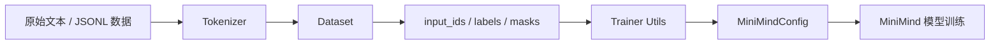
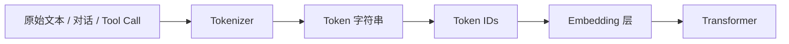
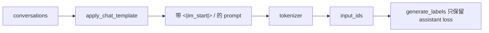
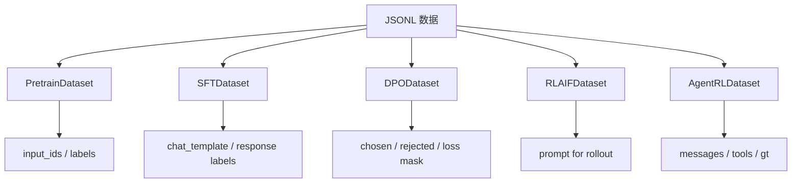
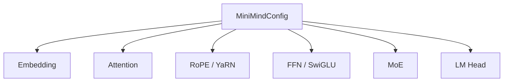

# 第一阶段：基础设施学习笔记

> 目标：先吃透 MiniMind 的训练底座，再进入模型结构。  
> 学习顺序：Tokenizer -> Dataset 数据组织 -> trainer_utils 训练工程 -> MiniMindConfig 维度地图。

这一阶段的核心问题不是“模型怎么算 attention”，而是：

1. 原始文本怎么变成模型能吃的 token ids？
2. 不同训练阶段的数据怎么组织成 input、label、mask？
3. 训练脚本怎么支持多卡、断点恢复、学习率调度？
4. 模型配置里的维度关系如何约束后续 Attention、FFN、RoPE 和 MoE？

可以用下面这张图理解第一阶段的位置：



面试开场可以这样讲：

> 我学习这个项目时没有直接从 Transformer Block 开始，而是先梳理了训练基础设施。因为 LLM 训练本质上是数据流工程：文本先通过 tokenizer 变成 token ids，再由 Dataset 组织成 input、label、mask，训练工具层负责学习率、多卡、checkpoint 和 resume，最后所有张量维度都由 MiniMindConfig 统一约束。这个底座打通后，后面的 Pretrain、SFT、LoRA、DPO、GRPO 才能复用同一套训练链路。

---

## 一、Tokenizer：文本到 Token IDs

### 1. 整体概况

Tokenizer 是 LLM 的第一道入口。模型本身不认识中文、英文、JSON、`<think>`、`<tool_call>` 这些字符串，它只认识整数 ID。



例如一段对话最终会变成类似：

```text
[1, 345, 912, 87, 2048, ..., 2]
```

这些整数才是模型真正的输入。

相关文件：

- `trainer/train_tokenizer.py`
- `model/tokenizer.json`
- `model/tokenizer_config.json`
- `dataset/lm_dataset.py`

其中 `train_tokenizer.py` 是学习参考脚本，项目默认使用 `model/` 下已经训练好的 tokenizer。

### 2. 为什么要这么做

第一，神经网络只能处理数字张量，所以文本必须先变成 token ids，再通过 embedding lookup 变成向量。

第二，不能简单按字符切，也不能简单按词切。按字符切会让英文、代码、JSON 很碎；按词切又会遇到大量未登录词。BPE 的做法是学习高频子词合并规则：常见片段可以合并成一个 token，不常见词可以拆成多个子词。

第三，MiniMind 不只是普通聊天模型，还要支持 reasoning 和 tool use，所以 tokenizer 必须把这些结构标记纳入词表：

```text
<|im_start|>
<|im_end|>
<think>
</think>
<tool_call>
</tool_call>
<tool_response>
</tool_response>
```

因此，Tokenizer 不只是“分词工具”，它定义了模型输入输出的协议。

面试说法：

> 在这个项目里，Tokenizer 的作用不只是压缩文本，而是定义训练和推理共享的数据协议。普通对话、SFT、DPO、thinking、tool calling 都依赖同一套特殊 token 和 chat template。如果 tokenizer 或 chat template 不一致，训练分布和推理分布就会错位。

### 3. 最关键的点

MiniMind 使用 BPE + ByteLevel：

```python
tokenizer = Tokenizer(models.BPE())
tokenizer.pre_tokenizer = pre_tokenizers.ByteLevel(add_prefix_space=False)
```

BPE 负责学习高频子词合并规则，ByteLevel 保证几乎任何字符都能被编码，包括中文、英文、符号、JSON、特殊格式。

词表大小是：

```python
VOCAB_SIZE = 6400
```

这个词表很小，符合 MiniMind 的定位：64M 小模型、低成本训练。词表越大，embedding 和 lm_head 参数越多。

因为 MiniMind 共享了 embedding 和 lm_head 权重，所以词表大小会直接影响参数量：

```text
embedding 参数量 = vocab_size * hidden_size
               = 6400 * 768
               ~= 4.9M
```

特殊 token 分三类：

```python
special_tokens_list = [
    "<|endoftext|>", "<|im_start|>", "<|im_end|>",
    ...
]

additional_tokens_list = [
    "<tool_call>", "</tool_call>",
    "<tool_response>", "</tool_response>",
    "<think>", "</think>"
]

buffer_tokens = [f"<|buffer{i}|>" ...]
```

含义：

- `<|im_start|>` / `<|im_end|>`：对话边界
- `<think>` / `</think>`：推理内容边界
- `<tool_call>` / `</tool_call>`：模型工具调用输出边界
- `<tool_response>` / `</tool_response>`：工具返回结果边界
- `<|buffer*>`：预留扩展位置

### 4. 源码详细拆解

#### 4.1 配置区

```python
DATA_PATH = '../dataset/sft_t2t_mini.jsonl'
TOKENIZER_DIR = '../model_learn_tokenizer/'
VOCAB_SIZE = 6400
SPECIAL_TOKENS_NUM = 36
```

含义：

- `DATA_PATH`：用 SFT 小数据作为 tokenizer 训练文本来源
- `TOKENIZER_DIR`：输出目录
- `VOCAB_SIZE=6400`：最终词表大小
- `SPECIAL_TOKENS_NUM=36`：特殊 token 总预留数量

Tokenizer 可以用 SFT 数据训练，不代表它只服务 SFT。它学到的是文本切分规则，后续 pretrain、SFT、DPO、GRPO 都会用同一个 tokenizer。

#### 4.2 `get_texts`

```python
def get_texts(data_path):
    with open(data_path, 'r', encoding='utf-8', errors='ignore') as f:
        for i, line in enumerate(f):
            if i >= 10000: break
            try:
                data = json.loads(line)
                contents = [
                    item.get('content')
                    for item in data.get('conversations', [])
                    if item.get('content')
                ]
                if contents:
                    yield "\n".join(contents)
            except json.JSONDecodeError:
                continue
```

这段做了几件事：

1. 逐行读取 JSONL。
2. 每一行是一条 conversation 数据。
3. 提取每个 message 里的 `content`。
4. 把多轮内容用换行拼起来。
5. 用 `yield` 流式返回文本。

为什么用 `yield`？

> 因为 tokenizer 训练可能面对很大数据，不需要一次性把所有文本读入内存。`train_from_iterator` 可以边读边训练。

#### 4.3 创建 BPE + ByteLevel tokenizer

```python
tokenizer = Tokenizer(models.BPE())
tokenizer.pre_tokenizer = pre_tokenizers.ByteLevel(add_prefix_space=False)
```

BPE 的作用：

```text
低频词：可以拆成多个 subword
高频词：可以合并成一个 token
```

ByteLevel 的作用：

```text
任意 UTF-8 字符都能被处理，减少 unknown token 问题
```

面试说法：

> 这个项目同时有中文、英文、代码、JSON、tool call 标签。ByteLevel BPE 对混合文本更稳，不容易因为字符集或罕见符号出现无法编码的问题。

#### 4.4 训练 BPE

```python
trainer = trainers.BpeTrainer(
    vocab_size=vocab_size,
    show_progress=True,
    initial_alphabet=pre_tokenizers.ByteLevel.alphabet(),
    special_tokens=all_special_tokens
)
texts = get_texts(data_path)
tokenizer.train_from_iterator(texts, trainer=trainer)
```

关键参数：

- `vocab_size=6400`：最终词表大小
- `initial_alphabet=ByteLevel.alphabet()`：把 byte-level 基础字符集放进去
- `special_tokens=all_special_tokens`：强制把特殊 token 加进词表，不能被 BPE 拆碎

最关键的是最后一点。如果不把 `<tool_call>` 加进词表，BPE 可能会把它拆成普通字符片段：

```text
"<", "tool", "_", "call", ">"
```

这样模型就很难稳定学会“这是一个工具调用边界”。

#### 4.5 保存 tokenizer 并修正 added tokens

```python
tokenizer.save(os.path.join(tokenizer_dir, "tokenizer.json"))
tokenizer.model.save(tokenizer_dir)
```

保存完整 tokenizer 配置和 BPE 规则。

后面有一段：

```python
for token_info in tokenizer_data.get('added_tokens', []):
    if token_info['content'] not in special_tokens_list:
        token_info['special'] = False
```

这一步区分了两类 token：

- 真正特殊 token：如 `<|im_start|>`、`<|im_end|>`
- 模型需要显式生成的协议 token：如 `<think>`、`<tool_call>`

后者不能简单当作 `skip_special_tokens=True` 时可跳过的 token，因为推理和工具调用解析时需要保留它们。

面试说法：

> 这里区分了 tokenizer 行为上的特殊 token 和模型需要显式生成的协议 token。`<tool_call>`、`<think>` 这类 token 最好保留在文本流里，让模型能学习和输出。

#### 4.6 `tokenizer_config.json`

核心字段：

```python
"bos_token": "<|im_start|>",
"eos_token": "<|im_end|>",
"pad_token": "<|endoftext|>",
"unk_token": "<|endoftext|>",
"model_max_length": 131072,
"chat_template": "...",
"tokenizer_class": "PreTrainedTokenizerFast"
```

这些字段会被后续 Dataset 直接使用，例如：

```python
tokens = [self.tokenizer.bos_token_id] + tokens + [self.tokenizer.eos_token_id]
```

以及：

```python
self.tokenizer.apply_chat_template(...)
```

这也是为什么 tokenizer 是“协议层”。

### 5. 和 Dataset 的连接

预训练阶段：

```python
tokens = self.tokenizer(str(sample['text']), add_special_tokens=False, ...).input_ids
tokens = [self.tokenizer.bos_token_id] + tokens + [self.tokenizer.eos_token_id]
input_ids = tokens + [self.tokenizer.pad_token_id] * ...
labels = input_ids.clone()
labels[input_ids == self.tokenizer.pad_token_id] = -100
```

SFT 阶段：

```python
prompt = self.create_chat_prompt(conversations)
input_ids = self.tokenizer(prompt).input_ids
labels = self.generate_labels(input_ids)
```

SFT 多了一步 `apply_chat_template`：



### 6. 面试串讲版

> MiniMind 的 tokenizer 是整个训练链路的输入协议层。它使用 BPE + ByteLevel，词表大小 6400，既能兼容中文、英文、代码、JSON 等混合文本，又能控制小模型的 embedding 和 lm_head 参数量。项目在 tokenizer 里提前注入了 `<|im_start|>`、`<|im_end|>`、`<think>`、`<tool_call>`、`<tool_response>` 等协议 token，使普通对话、推理链和工具调用可以共享同一套 chat template。训练脚本里通过 `BpeTrainer` 从 conversation content 中学习子词合并规则，并用 `tokenizer_config.json` 绑定 bos/eos/pad、chat_template 和 added_tokens_decoder。后续 Dataset 会调用 `apply_chat_template` 把结构化 messages 渲染成文本，再 tokenize 成 input_ids。Tokenizer 的 vocab size 必须和模型里的 embedding、lm_head 输出维度一致，所以不能随便重训或替换 tokenizer，否则 token-id 到语义的映射会和已有权重错位。

### 7. 高频追问

**问：为什么用 BPE + ByteLevel？**

答：因为项目数据包含中文、英文、工具调用 JSON、特殊标签。ByteLevel 可以保证任意字符都能编码，BPE 可以把高频片段合并成更短 token，兼顾鲁棒性和压缩率。

**问：为什么不能换 tokenizer？**

答：因为 token id 和 embedding 权重绑定。换 tokenizer 后，相同 id 的语义变了，已有模型权重就失效了。除非从头训练或者做 embedding 适配。

**问：chat_template 的作用是什么？**

答：它保证训练和推理格式一致，把结构化 message 转成模型实际看到的 prompt。SFT、DPO、Tool Use 都依赖它统一角色、thinking 和工具调用格式。

---

## 二、Dataset：数据如何变成 input、label、mask

虽然第一轮重点讲 Tokenizer，但它马上会被 Dataset 使用。相关文件是 `dataset/lm_dataset.py`。



### 1. `PretrainDataset`

预训练最简单：每条数据是 raw text，目标是 next-token prediction。

```python
tokens = self.tokenizer(str(sample['text']), add_special_tokens=False, ...).input_ids
tokens = [self.tokenizer.bos_token_id] + tokens + [self.tokenizer.eos_token_id]
input_ids = tokens + [self.tokenizer.pad_token_id] * ...
labels = input_ids.clone()
labels[input_ids == self.tokenizer.pad_token_id] = -100
```

重点：

- `input_ids` 是模型输入。
- `labels` 是训练目标。
- padding 位置设成 `-100`，因为 PyTorch `cross_entropy` 会忽略 `ignore_index=-100`。

面试说法：

> 预训练阶段不区分用户和助手，所有非 padding token 都参与 next-token loss。`-100` 是 PyTorch cross entropy 的 ignore index，用来忽略 padding 部分。

### 2. `SFTDataset`

SFT 阶段只希望模型学习 assistant 的回答，不希望它拟合 user prompt。

关键逻辑是 `generate_labels`：

```python
labels = [-100] * len(input_ids)
...
if input_ids[i:i + len(self.bos_id)] == self.bos_id:
    start = i + len(self.bos_id)
    ...
    labels[j] = input_ids[j]
```

它找到：

```text
<|im_start|>assistant
...
<|im_end|>
```

只把 assistant 区间设置为 label，其他位置都是 `-100`。

面试说法：

> SFT 和 Pretrain 的核心区别不是模型结构，而是 loss mask。Pretrain 对全部文本建模，SFT 只对 assistant response 计算 loss，这样模型学的是在给定指令下如何回答，而不是复读用户输入。

### 3. `DPODataset`

DPO 数据是 chosen/rejected 对。

每条样本会构造：

```python
x_chosen, y_chosen, mask_chosen
x_rejected, y_rejected, mask_rejected
```

它和 SFT 一样，只在 assistant 回答区间计算概率。

面试说法：

> DPO 不是简单分类 chosen/rejected，而是比较策略模型对 chosen answer 和 rejected answer 的相对 log probability，并和 reference model 的相对偏好做差。因此数据层必须同时返回 chosen 和 rejected，并且只在回答 token 上计算概率。

---

## 三、trainer_utils：训练工程底座

### 1. 整体概况

`trainer_utils.py` 是所有训练脚本的公共工具层。它解决：

```text
1. 模型参数怎么算？
2. 日志怎么只让主进程打印？
3. 学习率怎么随 step 衰减？
4. 单卡 / 多卡训练怎么统一启动？
5. 随机种子怎么固定？
6. checkpoint 怎么保存和恢复？
7. 模型和 tokenizer 怎么初始化？
8. 中断后怎么跳过已经训练过的 batch？
9. GRPO/RLAIF 怎么调用 reward model 打分？
```

面试说法：

> `trainer_utils.py` 是 MiniMind 的训练工程底座。它把所有训练阶段共享的逻辑抽出来，包括 DDP 初始化、cosine 学习率、checkpoint 保存与恢复、模型加载、MoE 参数统计和 batch 级 resume。这样 Pretrain、SFT、LoRA、DPO、GRPO 可以复用统一的训练基础设施。

### 2. `get_model_params`

```python
total = sum(p.numel() for p in model.parameters()) / 1e6
```

统计模型总参数量。

MoE 模型里有两个参数概念：

```text
Total Params：模型里所有参数
Active Params：每个 token 实际参与计算的参数
```

代码计算：

```python
base = total - (expert * n_routed) - (shared_expert * n_shared)
active = base + (expert * n_active) + (shared_expert * n_shared)
```

如果打印：

```text
Model Params: 198.00M-A64.00M
```

意思是：

```text
总参数 198M，但每个 token 实际激活约 64M
```

面试说法：

> MoE 的优势不是减少总参数，而是在增加模型容量的同时控制每个 token 的计算量。Total Params 表示容量，Active Params 更接近推理计算成本。

### 3. `is_main_process` 和 `Logger`

```python
def is_main_process():
    return not dist.is_initialized() or dist.get_rank() == 0

def Logger(content):
    if is_main_process():
        print(content)
```

DDP 多卡训练时，每张卡一个进程。如果每个进程都打印，会出现 N 份重复日志。所以只让 rank 0 打印。

面试说法：

> DDP 是多进程训练，每张卡一个进程。为了避免日志重复、checkpoint 重复保存，通常只让 rank 0 执行打印和保存操作。

### 4. `get_lr`

```python
def get_lr(current_step, total_steps, lr):
    return lr * (0.1 + 0.45 * (1 + math.cos(math.pi * current_step / total_steps)))
```

当 `current_step=0`：

```text
lr * (0.1 + 0.45 * 2) = lr
```

当 `current_step=total_steps`：

```text
lr * (0.1 + 0.45 * 0) = 0.1 * lr
```

所以学习率从初始 `lr` 平滑下降到 `0.1 * lr`。

```mermaid
xychart-beta
    title "Cosine LR Decay"
    x-axis "training progress" [0, 25, 50, 75, 100]
    y-axis "lr ratio" 0 --> 1
    line [1.0, 0.868, 0.55, 0.232, 0.1]
```

面试说法：

> 这里用 cosine schedule 平滑降低学习率，从初始 lr 降到 0.1 倍 lr。这样前期探索更快，后期收敛更稳，同时避免学习率突然变化。

### 5. `init_distributed_mode`

```python
if int(os.environ.get("RANK", -1)) == -1:
    return 0

dist.init_process_group(backend="nccl")
local_rank = int(os.environ["LOCAL_RANK"])
torch.cuda.set_device(local_rank)
return local_rank
```

如果没有 `RANK`，说明不是 DDP。  
如果通过 `torchrun` 启动，环境变量会包含：

```text
RANK
LOCAL_RANK
WORLD_SIZE
```

多卡关系：

```text
进程 0 -> LOCAL_RANK=0 -> cuda:0
进程 1 -> LOCAL_RANK=1 -> cuda:1
进程 2 -> LOCAL_RANK=2 -> cuda:2
进程 3 -> LOCAL_RANK=3 -> cuda:3
```

面试说法：

> 这个函数通过 `RANK` 判断是否是 DDP 模式。如果是 DDP，就初始化 NCCL process group，并用 `LOCAL_RANK` 绑定当前进程到对应 GPU。这样每张卡只跑自己的进程，避免多个进程抢同一张卡。

### 6. `setup_seed`

```python
random.seed(seed)
np.random.seed(seed)
torch.manual_seed(seed)
torch.cuda.manual_seed(seed)
torch.cuda.manual_seed_all(seed)
torch.backends.cudnn.deterministic = True
torch.backends.cudnn.benchmark = False
```

固定：

- Python random
- NumPy random
- PyTorch CPU random
- PyTorch CUDA random
- 多 GPU random

代价是可能牺牲一点速度。

面试说法：

> 固定随机种子是为了实验可复现。尤其是 AttnRes、LoRA Schema Matching 这种对比实验，如果不固定 seed，很难判断指标变化来自方法本身还是随机初始化。

### 7. `lm_checkpoint`

这是最重要的工程函数。

路径规则：

```python
ckp_path = f'{save_dir}/{weight}_{lm_config.hidden_size}{moe_path}.pth'
resume_path = f'{save_dir}/{weight}_{lm_config.hidden_size}{moe_path}_resume.pth'
```

例如：

```text
full_sft_768.pth
full_sft_768_resume.pth
```

两类文件含义：

```text
xxx.pth：干净模型权重，用于推理或下一阶段加载
xxx_resume.pth：训练状态，用于断点续训
```

保存时先剥离 DDP / compile 包装：

```python
raw_model = model.module if isinstance(model, DistributedDataParallel) else model
raw_model = getattr(raw_model, '_orig_mod', raw_model)
```

再保存 half CPU 权重：

```python
state_dict = {k: v.half().cpu() for k, v in state_dict.items()}
```

并采用临时文件原子替换：

```python
ckp_tmp = ckp_path + '.tmp'
torch.save(state_dict, ckp_tmp)
os.replace(ckp_tmp, ckp_path)
```

resume 保存完整训练现场：

```python
resume_data = {
    'model': state_dict,
    'optimizer': optimizer.state_dict(),
    'epoch': epoch,
    'step': step,
    'world_size': dist.get_world_size() if dist.is_initialized() else 1,
    'wandb_id': wandb_id
}
```

面试说法：

> 如果只保存 model，不保存 optimizer，恢复后 AdamW 的动量状态丢失，训练轨迹会改变。保存 epoch 和 step 是为了恢复数据进度，保存 world_size 是为了 GPU 数量变化时换算 step。

GPU 数量变化时：

```python
ckp_data['step'] = ckp_data['step'] * saved_ws // current_ws
```

面试说法：

> DDP 中 step 和 global data progress 跟 world size 有关。如果 GPU 数量变化，不换算 step 会导致数据重复或跳过。所以 resume 时要根据旧 world size 和当前 world size 调整 step。

### 8. `init_model`

```python
tokenizer = AutoTokenizer.from_pretrained(tokenizer_path)
model = MiniMindForCausalLM(lm_config)
```

加载权重：

```python
if from_weight != 'none':
    weight_path = f'{save_dir}/{from_weight}_{lm_config.hidden_size}{moe_suffix}.pth'
    weights = torch.load(weight_path, map_location=device)
    model.load_state_dict(weights, strict=False)
```

例如：

```text
from_weight='pretrain' -> pretrain_768.pth
from_weight='full_sft' -> full_sft_768.pth
from_weight='none' -> 从零训练
```

`strict=False` 可以兼容部分结构差异，但要注意检查 missing/unexpected keys。

### 9. `SkipBatchSampler`

作用：支持恢复到 epoch 内部某个 step。

```python
if skipped < self.skip_batches:
    skipped += 1
    batch = []
    continue
yield batch
```

面试说法：

> 大模型训练一个 epoch 可能很久，所以只恢复 epoch 不够。`SkipBatchSampler` 支持恢复到 epoch 内部某个 step，减少中断后的重复训练。

### 10. `LMForRewardModel`

用于 RLAIF / GRPO 阶段。

```python
score = self.model.get_score(self.tokenizer, eval_messages)
return max(min(score, 3.0), -3.0)
```

它把 reward 裁剪到 `[-3.0, 3.0]`。

面试说法：

> GRPO/RLAIF 阶段需要 reward signal。这里把 reward model 封装成统一接口，并对分数做 clip，避免极端 reward 放大策略更新。

### 11. trainer_utils 面试串讲版

> `trainer_utils.py` 是 MiniMind 的训练基础设施层。它把各训练阶段共享的工程逻辑统一封装起来，包括模型参数统计、主进程日志、cosine 学习率、DDP 初始化、随机种子、checkpoint 保存恢复、模型加载和 reward model 打分。这里我重点关注了三个工程细节：第一，DDP 下只让 rank 0 打印和保存，避免多进程重复操作；第二，checkpoint 分成普通权重和 resume 状态，resume 里保存 optimizer、epoch、step、world_size 等完整训练现场；第三，`SkipBatchSampler` 可以在恢复时跳过已经训练过的 batch，实现 step 级断点续训。对于 MoE 模型，它还区分 total params 和 active params，能更准确描述模型容量和实际计算成本。

---

## 四、MiniMindConfig：模型超参数和维度关系

### 1. 整体概况

`MiniMindConfig` 是整个模型的“参数说明书”。它不做计算，但后面所有模块都会读它：



源码在 `model/model_minimind.py`：

```python
class MiniMindConfig(PretrainedConfig):
    model_type = "minimind"
```

它继承 `PretrainedConfig`，是为了兼容 HuggingFace 风格的配置保存和加载。

### 2. 为什么要统一配置

模型里很多地方必须共享同一组超参数：

```text
Tokenizer 输出范围 = vocab_size
Embedding 行数 = vocab_size
LM Head 输出维度 = vocab_size

hidden_size = 每个 token 的隐藏向量维度
num_attention_heads = Q 头数量
head_dim = hidden_size / num_attention_heads
num_key_value_heads = K/V 头数量
```

如果这些参数不统一，模型会直接 shape mismatch。

### 3. 基础规模参数

```python
def __init__(self, hidden_size=768, num_hidden_layers=8, use_moe=False, **kwargs):
    self.hidden_size = hidden_size
    self.num_hidden_layers = num_hidden_layers
    self.use_moe = use_moe
    self.dropout = kwargs.get("dropout", 0.0)
    self.vocab_size = kwargs.get("vocab_size", 6400)
```

含义：

```text
hidden_size=768：每个 token 的隐藏向量维度
num_hidden_layers=8：Transformer Block 层数
use_moe=False：是否启用 MoE FFN
dropout=0.0：默认关闭 dropout
vocab_size=6400：和 tokenizer 绑定
```

`vocab_size` 会影响：

```python
nn.Embedding(config.vocab_size, config.hidden_size)
lm_head = nn.Linear(config.hidden_size, config.vocab_size, bias=False)
```

MiniMind 还共享 embedding 和 lm_head：

```python
self.model.embed_tokens.weight = self.lm_head.weight
```

面试说法：

> `vocab_size` 同时决定 tokenizer ID 范围、embedding 行数和 lm_head 输出维度。MiniMind 还共享 embedding 和 lm_head 权重，减少参数量。

### 4. Attention 参数

```python
self.flash_attn = kwargs.get("flash_attn", True)
self.num_attention_heads = kwargs.get("num_attention_heads", 8)
self.num_key_value_heads = kwargs.get("num_key_value_heads", 4)
self.head_dim = kwargs.get("head_dim", self.hidden_size // self.num_attention_heads)
```

默认关系：

```text
hidden_size = 768
num_attention_heads = 8
head_dim = 768 / 8 = 96
num_key_value_heads = 4
```

Attention 中的形状：

```text
hidden_states: [B, S, 768]
Q: [B, S, 8, 96]
K: [B, S, 4, 96]
V: [B, S, 4, 96]
```

因为 Q head 是 8，KV head 是 4：

```text
n_rep = 8 / 4 = 2
```

每个 KV head 被 2 个 Q head 共享，这就是 GQA。

面试说法：

> MiniMind 用 GQA，8 个 Q head，4 个 KV head。相比 MHA，它减少了 KV cache 和 K/V 投影参数；相比 MQA，它又保留了更多 KV 组，表达能力更好。

### 5. FFN 参数

```python
self.hidden_act = kwargs.get("hidden_act", 'silu')
self.intermediate_size = kwargs.get("intermediate_size", math.ceil(hidden_size * math.pi / 64) * 64)
```

当 `hidden_size=768`：

```text
768 * pi ~= 2412.7
ceil(2412.7 / 64) = 38
38 * 64 = 2432
```

所以 FFN 中间维度是 `2432`。

FFN 结构：

```text
gate_proj: 768 -> 2432
up_proj:   768 -> 2432
down_proj: 2432 -> 768
```

面试说法：

> MiniMind 的 FFN 不是传统 4 倍 hidden size，而是用接近 `pi * hidden_size` 后对齐到 64 的中间维度，兼顾参数量和硬件友好的维度对齐。

### 6. RoPE / YaRN 参数

```python
self.max_position_embeddings = kwargs.get("max_position_embeddings", 32768)
self.rms_norm_eps = kwargs.get("rms_norm_eps", 1e-6)
self.rope_theta = kwargs.get("rope_theta", 1e6)
self.inference_rope_scaling = kwargs.get("inference_rope_scaling", False)
```

关键含义：

```text
max_position_embeddings=32768：最大上下文长度 32K
rope_theta=1e6：RoPE 频率基数
rms_norm_eps=1e-6：RMSNorm 防止除零
```

如果启用 YaRN：

```python
self.rope_scaling = {
    "beta_fast": 32,
    "beta_slow": 1,
    "factor": 16,
    "original_max_position_embeddings": 2048,
    "attention_factor": 1.0,
    "type": "yarn"
}
```

面试说法：

> `max_position_embeddings` 决定预计算 RoPE cos/sin 的长度，`rope_theta` 控制旋转频率分布。YaRN scaling 用于推理阶段长上下文外推，把原始上下文扩展到更长范围。

### 7. MoE 参数

```python
self.num_experts = kwargs.get("num_experts", 4)
self.num_experts_per_tok = kwargs.get("num_experts_per_tok", 1)
self.moe_intermediate_size = kwargs.get("moe_intermediate_size", self.intermediate_size)
self.norm_topk_prob = kwargs.get("norm_topk_prob", True)
self.router_aux_loss_coef = kwargs.get("router_aux_loss_coef", 5e-4)
```

含义：

```text
num_experts=4：每层有 4 个专家
num_experts_per_tok=1：每个 token 只选 1 个专家
moe_intermediate_size：专家内部 FFN 维度
norm_topk_prob=True：top-k 路由权重归一化
router_aux_loss_coef=5e-4：负载均衡损失权重
```

面试说法：

> MoE 的目标是增加总参数容量，但每个 token 只激活部分专家，从而控制 active params。`router_aux_loss_coef` 用来缓解专家负载不均衡，避免所有 token 都被路由到少数专家。

### 8. MiniMindConfig 面试串讲版

> `MiniMindConfig` 是整个模型的超参数中心。默认 MiniMind-3 使用 `hidden_size=768`、`num_hidden_layers=8`、`vocab_size=6400`，对应 64M 级别小模型。Attention 部分是 GQA，`num_attention_heads=8`、`num_key_value_heads=4`、`head_dim=96`，所以每 2 个 Q head 共享 1 组 KV head，能降低 KV cache 和推理成本。FFN 部分使用 SiLU/SwiGLU，`intermediate_size` 默认按 `ceil(hidden_size*pi/64)*64` 计算，768 维时是 2432。位置编码使用 RoPE，最大上下文 32768，`rope_theta=1e6`，并支持 YaRN scaling 做长上下文外推。MoE 参数则通过 `use_moe` 开关控制，支持 4 experts、top-1 路由和 aux loss 负载均衡。这个 config 贯穿 embedding、attention、FFN、MoE、RoPE 和 lm_head，所有维度必须严格一致。

---

## 第一阶段自测清单

- [ ] 能否说明 tokenizer 为什么不能随便替换？
- [ ] 能否解释 BPE + ByteLevel 的优点？
- [ ] 能否说明 `<think>`、`<tool_call>` 为什么要进入词表？
- [ ] 能否解释 SFT 为什么只对 assistant response 计算 loss？
- [ ] 能否说明 `-100` 在 labels 里的作用？
- [ ] 能否说清楚 DDP 下为什么只让 rank 0 打印和保存？
- [ ] 能否解释 checkpoint 为什么要保存 optimizer、epoch、step、world_size？
- [ ] 能否说清楚 `SkipBatchSampler` 如何支持 step 级 resume？
- [ ] 能否算出 `hidden_size=768`、`num_attention_heads=8` 时 `head_dim=96`？
- [ ] 能否解释 GQA 中 8 个 Q head、4 个 KV head 的共享关系？
- [ ] 能否算出 `intermediate_size=2432` 的来源？
- [ ] 能否区分 MoE 的 Total Params 和 Active Params？

---

## 第一阶段 2 分钟总串讲

> 第一阶段我主要梳理 MiniMind 的基础设施。首先是 tokenizer，它使用 BPE + ByteLevel，词表大小 6400，并提前注入 `<|im_start|>`、`<|im_end|>`、`<think>`、`<tool_call>`、`<tool_response>` 等协议 token。它不仅负责文本到 token ids 的转换，也定义了训练和推理共享的 chat template。然后是 Dataset 层，不同训练阶段有不同的数据组织方式：Pretrain 对全部非 padding token 做 next-token loss；SFT 通过 assistant 区间 mask 只训练回答部分；DPO 同时返回 chosen/rejected 及其 loss mask。训练工程层由 `trainer_utils.py` 提供，包括 cosine 学习率、DDP 初始化、主进程日志、checkpoint 保存恢复、模型加载、SkipBatchSampler 和 reward model 封装。最后是 `MiniMindConfig`，它统一约束模型维度：`hidden_size=768`、`num_layers=8`、`vocab_size=6400`、`num_attention_heads=8`、`num_key_value_heads=4`、`head_dim=96`、`intermediate_size=2432`、上下文长度 32768，并支持 RoPE/YaRN 和 MoE 配置。这些基础设施打通后，后续模型结构和训练链路才能稳定复用。
