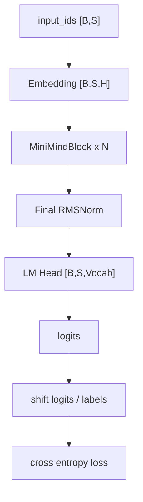
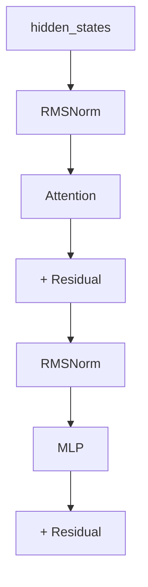
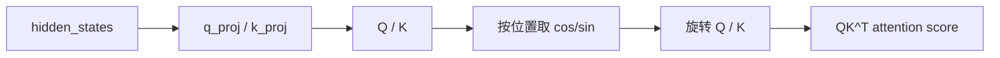
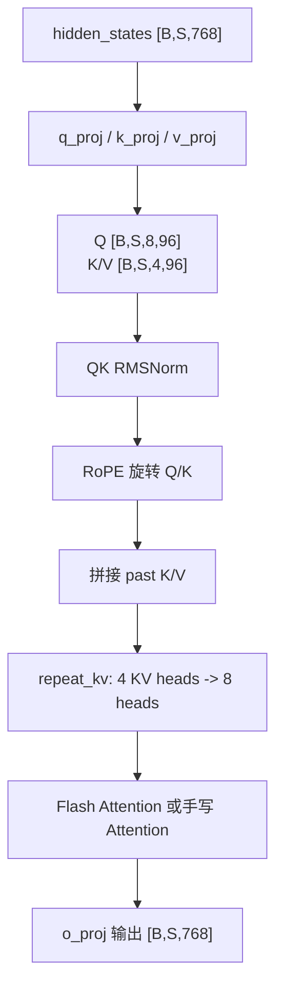
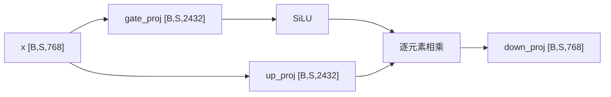
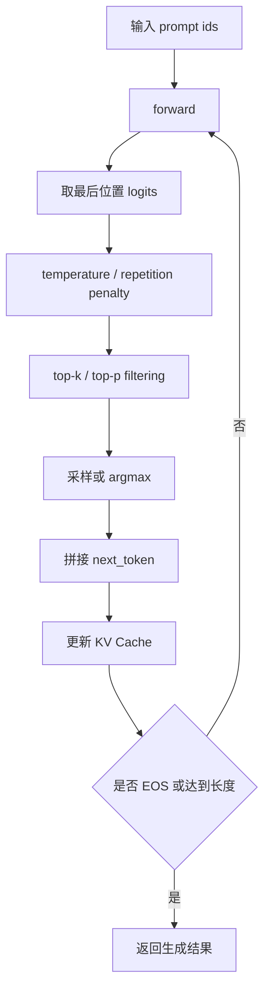

# 第二阶段：模型结构核心学习笔记

> 目标：能从 `input_ids` 一路讲到 `logits/loss`，并能解释 MiniMind 中 RMSNorm、RoPE、GQA Attention、SwiGLU、MoE、KV Cache 的设计动机和源码实现。

这一阶段承接第一阶段的基础设施。第一阶段解决的是“文本和训练工程怎么进入模型”，第二阶段解决的是“模型内部如何完成一次前向传播”。

整体结构如下：



学习顺序：

1. RMSNorm：归一化和 Pre-Norm 稳定性
2. RoPE / YaRN：位置编码和长上下文外推
3. Attention：GQA、QK Norm、Flash Attention、KV Cache
4. FeedForward / SwiGLU：token 内部非线性加工
5. MoEFeedForward：router、expert、active params、aux loss
6. MiniMindBlock -> MiniMindModel -> MiniMindForCausalLM：完整前向传播

---

## 一、RMSNorm

### 1. 整体概况

`RMSNorm` 是 MiniMind 里的核心归一化层。它的作用是稳定 hidden states 的尺度，避免随着层数加深，激活值越来越大或越来越不稳定。

源码位置：`model/model_minimind.py`

```python
class RMSNorm(torch.nn.Module):
    def __init__(self, dim: int, eps: float = 1e-5):
        super().__init__()
        self.eps = eps
        self.weight = nn.Parameter(torch.ones(dim))

    def norm(self, x):
        return x * torch.rsqrt(x.pow(2).mean(-1, keepdim=True) + self.eps)

    def forward(self, x):
        return (self.weight * self.norm(x.float())).type_as(x)
```

MiniMind 里 RMSNorm 出现的位置：

- Attention 里的 Q Norm
- Attention 里的 K Norm
- Transformer Block 里 Attention 前
- Transformer Block 里 MLP 前
- 模型最终输出前

### 2. 为什么需要归一化

Transformer 每层都有残差连接：

```text
hidden_states = hidden_states + attention_output
hidden_states = hidden_states + mlp_output
```

残差连接有利于梯度传播，但也会让 hidden states 的范数随层数累积。归一化的作用是让每个子层看到的输入尺度更稳定。

MiniMind 使用 Pre-Norm：



### 3. RMSNorm 和 LayerNorm 的区别

LayerNorm：

```text
LayerNorm(x) = (x - mean(x)) / sqrt(var(x) + eps) * gamma + beta
```

RMSNorm：

```text
RMSNorm(x) = x / sqrt(mean(x^2) + eps) * weight
```

区别：

| 对比 | LayerNorm | RMSNorm |
|---|---|---|
| 是否减均值 | 是 | 否 |
| 是否缩放尺度 | 是 | 是 |
| 是否常带 bias | 常见有 | MiniMind 无 bias |
| 计算量 | 稍高 | 更低 |
| 现代 LLM | 早期 Transformer 常见 | LLaMA/Qwen 常见 |

面试说法：

> RMSNorm 相比 LayerNorm 去掉了 mean-centering，只用均方根控制 hidden state 的尺度。这样计算更简单，也符合很多现代 decoder-only LLM 的设计。

### 4. 代码细节

核心公式：

```python
return x * torch.rsqrt(x.pow(2).mean(-1, keepdim=True) + self.eps)
```

如果 `x` 是：

```text
[batch, seq_len, hidden_size]
```

那么：

```text
x.pow(2).mean(-1, keepdim=True) -> [batch, seq_len, 1]
```

每个 token 都会得到自己的 RMS 缩放系数。

`self.weight` 是可学习缩放参数：

```text
普通 hidden RMSNorm: [768]
Q/K Norm: [96]
```

`x.float()` 的作用是混合精度下用 fp32 做归一化，最后 `.type_as(x)` 转回原 dtype。

### 5. 面试串讲版

> MiniMind 使用 RMSNorm 作为核心归一化层。相比 LayerNorm，RMSNorm 不减均值，只按 `x / sqrt(mean(x^2)+eps)` 控制向量尺度，然后乘一个可学习的 weight。代码里先把输入转成 fp32 做归一化，再转回原 dtype，保证混合精度训练下的稳定性。MiniMind 在每个 Block 中采用 Pre-Norm：Attention 前一个 RMSNorm，MLP 前一个 RMSNorm，最后输出到 lm_head 前还有一个 RMSNorm。同时 Attention 中还对 Q/K 做 head_dim 级别的 RMSNorm，也就是 QK Norm，用来控制 attention logits 的尺度。

---

## 二、RoPE 与 YaRN

### 1. 整体概况

Self-Attention 本身不感知 token 顺序。RoPE 的作用是给 Attention 注入位置信息。

传统位置编码通常是：

```text
token embedding + position embedding
```

RoPE 不直接加 position embedding，而是在 Attention 中对 Q 和 K 做位置相关旋转：



一句话：

> RoPE 不是把位置向量加到 hidden states 上，而是根据 token 位置旋转 Q 和 K，让 attention score 天然带上相对位置信息。

### 2. 为什么需要 RoPE

如果没有位置编码，模型很难区分：

```text
我喜欢你
你喜欢我
```

RoPE 的优势：

- 不需要单独学习 position embedding
- 通过旋转 Q/K 注入位置信息
- Q/K 点积后天然包含相对距离
- 更适合长上下文外推

面试说法：

> RoPE 的核心优势是把绝对位置信息转化到 Attention 的相对位置关系里。Q 在位置 m 旋转，K 在位置 n 旋转，两者点积会依赖 m-n，因此 attention score 自然包含相对距离。

### 3. `precompute_freqs_cis`

源码：

```python
def precompute_freqs_cis(dim: int, end: int = int(32 * 1024), rope_base: float = 1e6, rope_scaling: dict = None):
    freqs, attn_factor = 1.0 / (rope_base ** (torch.arange(0, dim, 2)[: (dim // 2)].float() / dim)), 1.0
```

默认配置：

```text
dim = head_dim = 96
end = max_position_embeddings = 32768
rope_base = rope_theta = 1e6
```

`torch.arange(0, dim, 2)` 在 `dim=96` 时得到 48 个频率，因为 RoPE 每两个维度组成一组旋转平面。

频率公式：

```text
freq_i = 1 / rope_base^(i / dim)
```

不同维度组使用不同频率：

```text
高频维度：更敏感于短距离
低频维度：更适合表示长距离
```

### 4. YaRN 缩放

配置来自 `MiniMindConfig`：

```python
self.rope_scaling = {
    "beta_fast": 32,
    "beta_slow": 1,
    "factor": 16,
    "original_max_position_embeddings": 2048,
    "attention_factor": 1.0,
    "type": "yarn"
} if self.inference_rope_scaling else None
```

当目标上下文长度大于原始长度时：

```python
ramp = torch.clamp((torch.arange(dim // 2, device=freqs.device).float() - low) / max(high - low, 0.001), 0, 1)
freqs = freqs * (1 - ramp + ramp / factor)
```

直觉：

```text
ramp = 0 的频率区间：基本不缩放
ramp = 1 的频率区间：除以 factor
中间区间：平滑过渡
```

面试说法：

> YaRN 不是简单把所有 RoPE 频率都除以扩展倍数，而是对不同频率区间做平滑插值。这样可以尽量保留短上下文能力，同时扩展长上下文外推范围。

### 5. 应用 RoPE

源码：

```python
def apply_rotary_pos_emb(q, k, cos, sin, unsqueeze_dim=1):
    def rotate_half(x):
        return torch.cat((-x[..., x.shape[-1] // 2:], x[..., : x.shape[-1] // 2]), dim=-1)
    q_embed = ((q * cos.unsqueeze(unsqueeze_dim)) + (rotate_half(q) * sin.unsqueeze(unsqueeze_dim))).to(q.dtype)
    k_embed = ((k * cos.unsqueeze(unsqueeze_dim)) + (rotate_half(k) * sin.unsqueeze(unsqueeze_dim))).to(k.dtype)
    return q_embed, k_embed
```

公式：

```text
rotary(x) = x * cos + rotate_half(x) * sin
```

RoPE 只作用于 Q/K，不作用于 V。因为位置影响的是 attention 权重，也就是 Q/K 的匹配分数；V 是被聚合的内容。

### 6. 面试串讲版

> MiniMind 使用 RoPE 作为位置编码。代码里先根据 `head_dim`、`max_position_embeddings` 和 `rope_theta` 预计算所有位置的 cos/sin，并注册成非持久 buffer。forward 时根据 `start_pos` 切出当前 token 对应的位置编码，然后在 Attention 里通过 `x*cos + rotate_half(x)*sin` 对 Q/K 做旋转。RoPE 只作用在 Q/K，不作用在 V，因为位置影响的是 attention score，也就是 token 之间的匹配关系。MiniMind 还支持 YaRN scaling，通过对不同频率区间做平滑缩放，把原始上下文外推到更长范围，同时尽量保留短距离能力。

---

## 三、Attention：GQA、QK Norm、Flash Attention、KV Cache

### 1. 整体概况

Self-Attention 负责让每个 token 从上下文中聚合信息：

```text
Attention(Q, K, V) = softmax(QK^T / sqrt(d)) V
```

直觉：

```text
Q：当前 token 想找什么信息
K：每个 token 提供什么索引
V：每个 token 真正携带的内容
```

MiniMind 的 Attention 流程：



### 2. GQA 参数

默认配置：

```text
hidden_size = 768
num_attention_heads = 8
num_key_value_heads = 4
head_dim = 96
n_rep = 8 / 4 = 2
```

Q/K/V 投影：

```text
q_proj: 768 -> 8 * 96 = 768
k_proj: 768 -> 4 * 96 = 384
v_proj: 768 -> 4 * 96 = 384
o_proj: 768 -> 768
```

相比 MHA，GQA 降低了 K/V 参数和 KV Cache 显存。

面试说法：

> MiniMind 使用 GQA，8 个 Q head，4 个 KV head，每 2 个 Q head 共享 1 组 KV。这样能降低 K/V 投影参数和 KV Cache 显存，同时保留较多查询头表达能力。

### 3. QK Norm 和 RoPE

源码逻辑：

```python
xq, xk, xv = self.q_proj(x), self.k_proj(x), self.v_proj(x)
xq = xq.view(bsz, seq_len, self.n_local_heads, self.head_dim)
xk = xk.view(bsz, seq_len, self.n_local_kv_heads, self.head_dim)
xv = xv.view(bsz, seq_len, self.n_local_kv_heads, self.head_dim)
xq, xk = self.q_norm(xq), self.k_norm(xk)
cos, sin = position_embeddings
xq, xk = apply_rotary_pos_emb(xq, xk, cos, sin)
```

shape：

```text
xq: [B, S, 8, 96]
xk: [B, S, 4, 96]
xv: [B, S, 4, 96]
```

QK Norm 控制 Q/K 尺度，RoPE 注入位置。

### 4. KV Cache

源码：

```python
if past_key_value is not None:
    xk = torch.cat([past_key_value[0], xk], dim=1)
    xv = torch.cat([past_key_value[1], xv], dim=1)
past_kv = (xk, xv) if use_cache else None
```

推理时历史 token 的 K/V 不变，可以缓存起来。新一步只计算新增 token 的 K/V，再与历史 K/V 拼接。

MiniMind 缓存的是 repeat 前的 K/V：

```text
[B, past_len, 4, 96]
```

这样比缓存 repeat 后的 `[B, past_len, 8, 96]` 更省显存。

### 5. `repeat_kv`

```python
def repeat_kv(x: torch.Tensor, n_rep: int) -> torch.Tensor:
    bs, slen, num_key_value_heads, head_dim = x.shape
    if n_rep == 1: return x
    return (
        x[:, :, :, None, :]
        .expand(bs, slen, num_key_value_heads, n_rep, head_dim)
        .reshape(bs, slen, num_key_value_heads * n_rep, head_dim)
    )
```

默认：

```text
[B, S, 4, 96] -> [B, S, 8, 96]
```

直观：

```text
[K0, K1, K2, K3] -> [K0, K0, K1, K1, K2, K2, K3, K3]
```

### 6. Flash Attention 和手写分支

Flash 分支：

```python
if self.flash and (seq_len > 1) and (past_key_value is None) and (attention_mask is None or torch.all(attention_mask == 1)):
    output = F.scaled_dot_product_attention(xq, xk, xv, dropout_p=self.dropout if self.training else 0.0, is_causal=True)
```

手写分支：

```python
scores = (xq @ xk.transpose(-2, -1)) / math.sqrt(self.head_dim)
scores[:, :, :, -seq_len:] += torch.full((seq_len, seq_len), float("-inf"), device=scores.device).triu(1)
if attention_mask is not None:
    scores += (1.0 - attention_mask.unsqueeze(1).unsqueeze(2)) * -1e9
output = self.attn_dropout(F.softmax(scores.float(), dim=-1).type_as(xq)) @ xv
```

Flash 分支适合标准训练场景；手写分支处理 KV Cache 和复杂 mask。

### 7. 面试串讲版

> MiniMind 的 Attention 使用 GQA。输入 hidden states 是 `[B,S,768]`，Q 投影成 8 个 heads，每个 96 维；K/V 只投影成 4 个 heads，每个 96 维。这样每 2 个 Q head 共享 1 个 KV head，减少 K/V 参数和 KV Cache 显存。代码先对 Q/K 做 RMSNorm，再应用 RoPE 注入位置信息。推理时如果有 past key/value，就把历史 K/V 和当前 K/V 在序列维拼接，并在计算 attention 前通过 `repeat_kv` 把 4 个 KV heads 扩展到 8 个 heads。训练时没有复杂 mask 会走 PyTorch SDPA 加速；否则走手写分支显式计算 QK 点积、causal mask、padding mask、softmax 和乘 V。最后把多头输出合并回 `[B,S,768]`，经过 `o_proj` 返回。

---

## 四、FeedForward / SwiGLU

### 1. 整体概况

Attention 负责 token 之间的信息交互，FFN 负责每个 token 内部的特征变换。

```text
Attention：token 之间通信
FFN：token 内部特征加工
```

MiniMind 使用 SwiGLU：

```python
return self.down_proj(self.act_fn(self.gate_proj(x)) * self.up_proj(x))
```

### 2. 结构

默认配置：

```text
hidden_size = 768
intermediate_size = 2432
hidden_act = "silu"
```

三个线性层：

```text
gate_proj: 768 -> 2432
up_proj:   768 -> 2432
down_proj: 2432 -> 768
```

数据流：



### 3. SwiGLU 直觉

SwiGLU 有两路：

```text
内容路：up_proj(x)
门控路：SiLU(gate_proj(x))
```

然后：

```text
内容路 * 门控路
```

门控路决定哪些特征被增强，哪些特征被抑制。

### 4. 参数量

单层 FFN 参数量：

```text
gate_proj: 768 * 2432 ~= 1.87M
up_proj:   768 * 2432 ~= 1.87M
down_proj: 2432 * 768 ~= 1.87M

合计 ~= 5.60M / layer
```

8 层约：

```text
5.60M * 8 ~= 44.8M
```

面试说法：

> Transformer 的参数不只在 Attention，FFN 往往占很大比例。MiniMind 的 SwiGLU 有 gate、up、down 三个矩阵，所以 FFN 是模型参数量的重要组成部分。

---

## 五、MoEFeedForward

### 1. 整体概况

普通 FFN：

```text
每个 token -> 同一个 FeedForward
```

MoE FFN：

```text
每个 token -> router 打分 -> 选择 top-k expert -> 只计算选中的 expert -> 加权合并
```

MiniMind 默认：

```text
num_experts = 4
num_experts_per_tok = 1
```

也就是每层有 4 个专家，但每个 token 只走 1 个专家。

### 2. 初始化

```python
self.gate = nn.Linear(config.hidden_size, config.num_experts, bias=False)
self.experts = nn.ModuleList([
    FeedForward(config, intermediate_size=config.moe_intermediate_size)
    for _ in range(config.num_experts)
])
```

Router：

```text
768 -> 4
```

Experts：

```text
4 个 SwiGLU FeedForward
```

### 3. forward

展平 token：

```python
batch_size, seq_len, hidden_dim = x.shape
x_flat = x.view(-1, hidden_dim)
```

router 打分：

```python
scores = F.softmax(self.gate(x_flat), dim=-1)
```

top-k：

```python
topk_weight, topk_idx = torch.topk(scores, k=self.config.num_experts_per_tok, dim=-1, sorted=False)
```

权重归一化：

```python
topk_weight = topk_weight / (topk_weight.sum(dim=-1, keepdim=True) + 1e-20)
```

按 expert 分发 token，并用 `index_add_` 合并：

```python
y.index_add_(0, token_idx, (expert(x_flat[token_idx]) * weight).to(y.dtype))
```

`index_add_` 支持 top-k 多专家输出累加。

### 4. DDP unused expert 处理

```python
elif self.training:
    y[0, 0] += 0 * sum(p.sum() for p in expert.parameters())
```

如果某个 expert 没有 token 路由过去，它的参数可能在 DDP 中被视为 unused。这里用 `0 * params` 让它以零贡献方式接入计算图。

### 5. Router Aux Loss

```python
load = F.one_hot(topk_idx, self.config.num_experts).float().mean(0)
self.aux_loss = (load * scores.mean(0)).sum() * self.config.num_experts * self.config.router_aux_loss_coef
```

作用：缓解专家负载不均衡，避免 router 总是选择少数专家。

### 6. Total Params vs Active Params

MoE 一定要区分：

```text
Total Params：所有专家 + 共享部分的总参数，代表模型容量
Active Params：每个 token 实际参与计算的参数，更接近推理成本
```

如果打印：

```text
Model Params: 198M-A64M
```

表示总参数 198M，但每个 token 激活约 64M。

面试说法：

> MoE 的核心价值是增加 total params 提升模型容量，但每个 token 只激活 top-k experts，所以 active params 和实际计算成本仍然可控。

---

## 六、MiniMindBlock -> MiniMindModel -> MiniMindForCausalLM

### 1. 三层封装

```text
MiniMindBlock
    一个 Transformer Block：Attention + FFN/MoE

MiniMindModel
    Embedding + 多层 MiniMindBlock + final norm

MiniMindForCausalLM
    MiniMindModel + lm_head + loss + generate
```

### 2. MiniMindBlock

```python
residual = hidden_states
hidden_states, present_key_value = self.self_attn(
    self.input_layernorm(hidden_states), position_embeddings,
    past_key_value, use_cache, attention_mask
)
hidden_states += residual
hidden_states = hidden_states + self.mlp(self.post_attention_layernorm(hidden_states))
```

结构：

```text
x
├─ RMSNorm -> Attention -> +
└─────────────────────────┘

x'
├─ RMSNorm -> FFN/MoE -> +
└────────────────────────┘
```

这是标准 Pre-Norm Decoder Block。

### 3. MiniMindModel

```python
self.embed_tokens = nn.Embedding(config.vocab_size, config.hidden_size)
self.layers = nn.ModuleList([MiniMindBlock(l, config) for l in range(self.num_hidden_layers)])
self.norm = RMSNorm(config.hidden_size, eps=config.rms_norm_eps)
```

forward 流程：

```text
input_ids [B,S]
-> embedding [B,S,768]
-> 切片 RoPE cos/sin
-> 经过 8 个 MiniMindBlock
-> final RMSNorm
-> hidden_states [B,S,768]
```

同时收集：

```text
presents：每层 KV Cache
aux_loss：MoE router 负载均衡 loss
```

### 4. MiniMindForCausalLM

```python
self.model = MiniMindModel(self.config)
self.lm_head = nn.Linear(self.config.hidden_size, self.config.vocab_size, bias=False)
self.model.embed_tokens.weight = self.lm_head.weight
```

关键点：embedding 和 lm_head 权重共享。

```text
输入时：token id -> embedding vector
输出时：hidden vector -> vocab logits
```

共享权重可以减少参数，并让输入输出 token 表示处在同一语义空间。

### 5. Loss 计算

```python
logits = self.lm_head(hidden_states[:, slice_indices, :])
if labels is not None:
    x, y = logits[..., :-1, :].contiguous(), labels[..., 1:].contiguous()
    loss = F.cross_entropy(x.view(-1, x.size(-1)), y.view(-1), ignore_index=-100)
```

Causal LM 用当前位置预测下一个 token：

```text
位置 0 输入 BOS   -> 预测 token 1
位置 1 输入 token1 -> 预测 token 2
```

所以要 shift：

```text
logits[..., :-1, :] 对齐 labels[..., 1:]
```

`ignore_index=-100` 用于忽略 padding 或 SFT 中非 assistant 区间。

### 6. generate

自回归生成流程：



核心：

```python
past_len = past_key_values[0][0].shape[1] if past_key_values else 0
outputs = self.forward(input_ids[:, past_len:], attention_mask, past_key_values, use_cache=use_cache, **kwargs)
```

有 KV Cache 时，只输入新增 token，避免重复计算历史上下文。

### 7. 完整 shape 总结

假设：

```text
B = 4
S = 512
H = 768
V = 6400
L = 8
```

形状流：

```text
input_ids: [4, 512]
embedding: [4, 512, 768]
8 layers:  [4, 512, 768]
lm_head:   [4, 512, 6400]
loss:
  logits[..., :-1, :] -> [4, 511, 6400]
  labels[..., 1:]     -> [4, 511]
```

### 8. 面试串讲版

> MiniMind 的模型主体分三层封装。`MiniMindBlock` 是一个 Pre-Norm Decoder Block，结构是 RMSNorm -> Attention -> Residual，再 RMSNorm -> FFN/MoE -> Residual。`MiniMindModel` 负责把 token ids 通过 embedding 变成 `[B,S,hidden]`，预计算并切片 RoPE cos/sin，然后依次经过 8 个 block，最后做 final RMSNorm，并收集每层的 KV Cache 和 MoE aux loss。`MiniMindForCausalLM` 在底层模型上加了 `lm_head`，把 hidden states 映射到 vocab logits，同时做 embedding 和 lm_head 权重共享。训练时通过 shift logits 和 labels 计算 next-token cross entropy，忽略 label 为 `-100` 的位置；推理时 `generate` 逐 token 自回归生成，配合 KV Cache 只计算新增 token，并支持 temperature、top-k、top-p 和 repetition penalty。

---

## 第二阶段自测清单

- [ ] 能否说清 RMSNorm 和 LayerNorm 的区别？
- [ ] 能否解释为什么 RMSNorm 中要 `x.float()`？
- [ ] 能否说清 RoPE 为什么作用在 Q/K 而不是 V？
- [ ] 能否解释 RoPE 为什么能表示相对位置？
- [ ] 能否画出 Attention 中 Q/K/V 的 shape？
- [ ] 能否解释 GQA 中 8 个 Q heads 和 4 个 KV heads 的共享关系？
- [ ] 能否说明 KV Cache 为什么缓存 repeat 前的 K/V？
- [ ] 能否解释 Flash Attention 分支和手写分支的区别？
- [ ] 能否写出 SwiGLU 的公式？
- [ ] 能否解释 MoE 的 router、expert、top-k、aux loss？
- [ ] 能否区分 Total Params 和 Active Params？
- [ ] 能否从 `input_ids` 一路讲到 `logits` 和 `loss`？

---

## 第二阶段 2 分钟总串讲

> MiniMind 的模型结构是一个轻量级 decoder-only Transformer。输入 `input_ids` 先经过 embedding 得到 `[B,S,768]` 的 hidden states，然后进入 8 层 MiniMindBlock。每个 Block 是 Pre-Norm 结构：先 RMSNorm，再 Attention，再 residual；然后 RMSNorm，再 FFN 或 MoE，再 residual。Attention 部分使用 GQA，8 个 Q heads、4 个 KV heads，每 2 个 Q head 共享 1 个 KV head，减少 KV 投影和 KV Cache 显存；同时对 Q/K 做 RMSNorm，并通过 RoPE 注入位置信息。FFN 使用 SwiGLU，`gate_proj` 和 `up_proj` 扩展到 2432 维，门控相乘后由 `down_proj` 压回 768 维。MoE 版本则用 router 为每个 token 选择 top-k expert，只激活部分专家，并通过 aux loss 缓解负载不均衡。所有 block 后接 final RMSNorm，再通过共享权重的 lm_head 映射到 vocab logits。训练时使用 shift logits/labels 计算 next-token cross entropy；推理时 `generate` 逐 token 生成，并用 KV Cache 复用历史 K/V。
