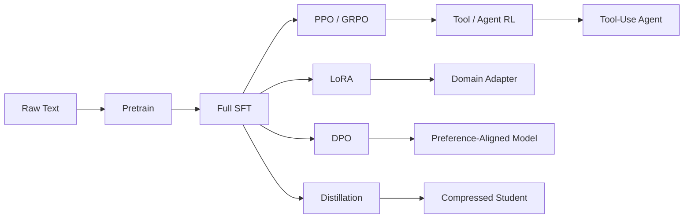

# 第三阶段：标准训练全链路学习笔记

> 目标：能够把 MiniMind 的训练路线从 `pretrain -> sft -> lora -> dpo -> ppo/grpo -> tool/agent_rl -> distillation` 连成一条完整故事线，并且在面试中讲清楚每一步“训练什么、为什么这么训、代码怎么实现、和上一阶段有什么区别”。

这一阶段承接前两阶段：

- 第一阶段解决“文本如何进入训练系统”：Tokenizer、Dataset、Trainer Utils、Config。
- 第二阶段解决“模型一次 forward 如何从 input_ids 走到 logits/loss”：RMSNorm、RoPE、GQA、SwiGLU、MoE、KV Cache。
- 第三阶段解决“模型能力如何一步步训练出来”：从语言建模，到指令跟随，到参数高效适配，再到偏好对齐、强化学习、工具调用和蒸馏。

整体训练链路如下：



---

## 0. 总览：每个训练阶段到底改变了什么

| 阶段 | 主要脚本 | 数据形式 | 优化目标 | 面试关键词 |
|---|---|---|---|---|
| Pretrain | `trainer/train_pretrain.py` | 普通文本 `text` | next token prediction | 语言建模、shift label、CE |
| Full SFT | `trainer/train_full_sft.py` | 多轮对话 `conversations` | 只学习 assistant 回复 | chat template、label mask |
| LoRA | `trainer/train_lora.py` + `model/model_lora.py` | SFT 格式领域数据 | 只训练低秩适配器 | 参数高效微调、冻结基座 |
| DPO | `trainer/train_dpo.py` | `chosen/rejected` 偏好对 | chosen 相对 rejected 更优 | reference model、logratio |
| PPO | `trainer/train_ppo.py` | prompt 数据 | reward + value + clipped policy update | actor、critic、reward、KL |
| GRPO | `trainer/train_grpo.py` | prompt 数据 | 组内 reward 相对优势 | no critic、group advantage |
| Tool / Agent RL | `trainer/train_agent.py` | messages + tools + gt | 工具调用轨迹 reward | tool_call、tool_response、多轮 rollout |
| Distillation | `trainer/train_distillation.py` | SFT 数据或 teacher 输出 | CE + KL 或黑盒 SFT | teacher/student、temperature |

最适合面试的总述：

> MiniMind 的训练链路是从通用语言能力开始，先通过 pretrain 学会 next token prediction；再通过 SFT 学会按 chat template 回答；之后用 LoRA 做领域参数高效适配，用 DPO/PPO/GRPO 做偏好和 reward 对齐；再通过 Agent RL 训练工具调用能力；最后用知识蒸馏把教师模型的行为或分布压缩到小模型里。这个项目的特点是这些环节都用原生 PyTorch 实现，没有依赖高层训练框架，所以我可以讲清楚每个 loss、mask、logprob 和 checkpoint 的实现细节。

---

## 1. Pretrain：从普通文本学语言建模

### 1.1 整体概况

Pretrain 是 MiniMind 训练链路的第一步。它不关心“用户/助手”角色，也不关心答案质量，只做一件事：

```text
给定前面的 token，预测下一个 token
```

对应文件：

- `trainer/train_pretrain.py`
- `dataset/lm_dataset.py` 中的 `PretrainDataset`
- `trainer/trainer_utils.py` 中的 `init_model`、`get_lr`、`lm_checkpoint`、`SkipBatchSampler`

数据大致是 JSONL：

```json
{"text": "一段普通文本..."}
```

训练后得到：

```text
../out/pretrain_768.pth
```

### 1.2 为什么要做 Pretrain

如果直接做 SFT，模型还没有基本语言建模能力，就很难学会稳定生成。Pretrain 的作用是让模型先掌握：

- 字符、词语、标点、语法的统计规律
- 中文/英文的基本连续文本生成能力
- 常识性 token 共现关系
- 自回归生成的基础能力

面试里可以说：

> Pretrain 阶段相当于给模型打语言底座。它不学习具体任务，而是通过 next token prediction 让模型具备基本语言分布建模能力。后面的 SFT、DPO、RL 都是在这个语言底座上做行为对齐。

### 1.3 最关键的点

第一，输入和标签几乎一样。

`PretrainDataset` 会构造：

```text
input_ids = [BOS] + tokens + [EOS] + [PAD...]
labels = input_ids.clone()
labels[PAD] = -100
```

真正 shift 是在模型 loss 里做：

```text
logits[:, :-1] 预测 labels[:, 1:]
```

第二，`-100` 是 PyTorch cross entropy 的 ignore index。PAD token 不参与 loss。

第三，训练脚本的工程骨架已经是后续所有 trainer 的模板：

```text
argparse -> DDP -> seed -> config -> init_model -> dataset/dataloader
-> optimizer -> AMP -> gradient accumulation -> checkpoint
```

### 1.4 代码拆解

`PretrainDataset.__getitem__` 做三步：

1. 从 JSONL 取 `sample["text"]`
2. tokenizer 编码并截断到 `max_length - 2`
3. 加 `BOS/EOS/PAD`，构造 labels

训练循环里核心是：

```python
with autocast_ctx:
    res = model(input_ids, labels=labels)
    loss = res.loss + res.aux_loss
    loss = loss / args.accumulation_steps
```

`res.loss` 是语言模型 CE loss；如果是 MoE 模型，`res.aux_loss` 用于专家负载均衡。

学习率由 `get_lr()` 控制，是 cosine 衰减：

```text
lr * (0.1 + 0.45 * (1 + cos(pi * current_step / total_steps)))
```

断点续训靠 `lm_checkpoint()` 和 `SkipBatchSampler`：

- `lm_checkpoint()` 保存模型、optimizer、scaler、epoch、step。
- `SkipBatchSampler` 用于恢复到 epoch 中间的某个 step。

### 1.5 面试串讲版

> Pretrain 阶段使用 `PretrainDataset` 读取普通文本，把文本转成 `[BOS] tokens [EOS] [PAD]`，labels 和 input_ids 基本一致，只把 PAD 位置设为 `-100` 忽略。模型内部做 shift，用当前位置预测下一个 token。训练脚本支持 AMP、梯度累积、DDP、cosine 学习率和断点续训。这个阶段主要学习通用语言建模能力，是后面 SFT 和对齐训练的底座。

### 1.6 高频追问

Q：为什么 label 里 PAD 要设成 `-100`？  
A：因为 cross entropy 会忽略 `ignore_index=-100` 的位置，避免模型学习预测 padding。

Q：pretrain 和 sft 的 loss 有什么区别？  
A：pretrain 基本所有非 PAD token 都算 loss；SFT 只在 assistant 回复部分算 loss。

---

## 2. Full SFT：从语言模型变成聊天助手

### 2.1 整体概况

SFT，全称 Supervised Fine-Tuning。它让模型从“会续写文本”变成“会按用户指令回答”。

对应文件：

- `trainer/train_full_sft.py`
- `dataset/lm_dataset.py` 中的 `SFTDataset`

默认从 pretrain 权重开始：

```text
--from_weight pretrain
--save_weight full_sft
```

数据格式：

```json
{
  "conversations": [
    {"role": "user", "content": "问题"},
    {"role": "assistant", "content": "回答"}
  ]
}
```

### 2.2 为什么要做 SFT

Pretrain 只学语言分布，不知道什么是“用户问题”和“助手回答”。SFT 的作用是让模型学会：

- 多轮对话格式
- 指令跟随
- assistant 角色的回答风格
- tool/thinking 等特殊格式的基本模式

### 2.3 最关键的点：只训练 assistant 回复

SFT 和 pretrain 最大区别不是模型结构，而是 label mask。

`SFTDataset.generate_labels()` 默认把所有位置设成 `-100`：

```python
labels = [-100] * len(input_ids)
```

然后只把 assistant 回复区间改成真实 token id。

也就是说：

```text
system/user token: 不算 loss
assistant token: 算 loss
pad token: 不算 loss
```

如果不这么做，模型会被训练去预测用户问题，甚至学会自问自答，角色边界会乱。

### 2.4 Chat Template 的作用

SFT 使用 tokenizer 的 `apply_chat_template()` 把结构化 messages 转成真实训练文本。

示意：

```text
<|im_start|>user
问题
<|im_end|>
<|im_start|>assistant
回答
<|im_end|>
```

训练和推理都使用同一个 template，这是非常重要的工程一致性。

面试里可以说：

> SFT 的关键不是简单拼接问答，而是保证训练和推理使用同一套 chat template，同时通过 label mask 只优化 assistant 回复部分。

### 2.5 代码拆解

`SFTDataset.create_chat_prompt()`：

- 解析 system/user/assistant/tool 等 message
- 如果有 `tools`，传给 tokenizer 的 chat template
- 如果 `tool_calls` 是字符串，会先 `json.loads`

`SFTDataset.generate_labels()`：

- 找到 assistant 起始 token 序列
- 找到 assistant 结束 token 序列
- 只把这段 assistant 内容设为 label

`train_full_sft.py` 训练逻辑和 pretrain 很像：

```python
res = model(input_ids, labels=labels)
loss = res.loss + res.aux_loss
```

主要区别在数据和 labels。

### 2.6 面试串讲版

> Full SFT 阶段从 pretrain 权重加载模型，使用多轮对话数据训练模型按 assistant 角色回答。数据集会通过 tokenizer 的 `apply_chat_template` 把 messages 转成统一文本格式，然后只对 assistant 回复 token 生成 labels，system/user/pad 都是 `-100`。因此 SFT 不是重新训练语言能力，而是在已有语言模型上学习指令跟随和对话格式。

---

## 3. LoRA：参数高效领域微调

### 3.1 整体概况

LoRA 接在 `full_sft` 后面，用于领域或任务适配。对应文件：

- `model/model_lora.py`
- `trainer/train_lora.py`

核心思想：

```text
原始 Linear: y = W x
加入 LoRA:   y = W x + B A x
```

其中 `A` 降维，`B` 升维，`rank` 远小于 hidden size。

### 3.2 为什么要做 LoRA

全量微调会更新整个模型，显存和存储成本高，而且每个任务都要保存完整权重。LoRA 只训练少量低秩参数：

- 显存更低
- 训练更快
- 基座能力不容易被破坏
- 不同任务可以保存不同 adapter
- 部署时可以动态加载，也可以 merge 回原权重

### 3.3 最关键的点

`LoRA` 类中有两个线性层：

```python
self.A = nn.Linear(in_features, rank, bias=False)
self.B = nn.Linear(rank, out_features, bias=False)
```

如果原始层是 `768 x 768`，全量参数是：

```text
768 * 768 = 589,824
```

LoRA rank=16 时：

```text
768 * 16 + 16 * 768 = 24,576
```

只有原来的约 `4.17%`。

初始化也很关键：

- `A` 正态初始化
- `B` 初始化为 0

这样刚注入 LoRA 时：

```text
B(A(x)) = 0
```

模型输出不会突然改变。

### 3.4 代码拆解

`apply_lora()` 会遍历模型：

```python
for name, module in model.named_modules():
    if isinstance(module, nn.Linear) and module.weight.shape[0] == module.weight.shape[1]:
        ...
```

注意：这个项目只给“方阵 Linear”注入 LoRA。这是教学友好的简化实现，但覆盖范围比工业级 PEFT 更保守。

注入方式是 monkey patch：

```python
original_forward = module.forward

def forward_with_lora(x, layer1=original_forward, layer2=lora):
    return layer1(x) + layer2(x)

module.forward = forward_with_lora
```

这里 `layer1=...`、`layer2=...` 是为了避免 Python 闭包晚绑定问题。

`train_lora.py` 里：

```python
model, tokenizer = init_model(lm_config, args.from_weight, device=args.device)
apply_lora(model, rank=args.lora_rank)
```

默认：

```text
--from_weight full_sft
--lora_rank 16
```

然后冻结普通参数，只训练包含 `lora` 的参数：

```python
if 'lora' in name:
    param.requires_grad = True
else:
    param.requires_grad = False
```

保存时 `save_lora()` 只保存 `.lora.` 参数。部署时 `merge_lora()` 会做：

```text
W' = W + B @ A
```

### 3.5 面试串讲版

> LoRA 阶段是在 full_sft 基座上做参数高效微调。实现上我从零写了 LoRA 模块，给部分方阵 Linear 动态挂载 `lora` 分支，forward 变成原始 Linear 输出加 LoRA 输出。训练时冻结原模型，只训练 `A/B` 两个低秩矩阵。保存时只保存 adapter 参数，部署时可以单独加载，也可以把 `B @ A` 合并回原权重。

---

## 4. DPO：静态偏好对齐

### 4.1 整体概况

DPO 是 Direct Preference Optimization。它用 `chosen/rejected` 偏好对训练模型，让模型更偏向好回答。

对应文件：

- `trainer/train_dpo.py`
- `dataset/lm_dataset.py` 中的 `DPODataset`

数据形式：

```json
{
  "chosen": [
    {"role": "user", "content": "问题"},
    {"role": "assistant", "content": "好回答"}
  ],
  "rejected": [
    {"role": "user", "content": "问题"},
    {"role": "assistant", "content": "差回答"}
  ]
}
```

### 4.2 为什么要做 DPO

SFT 只告诉模型“模仿这个答案”，但不告诉模型“这个答案比另一个答案好”。DPO 通过成对偏好数据告诉模型：

```text
同一个问题下 chosen 应该比 rejected 更受模型偏好
```

DPO 不需要 reward model，也不需要 PPO 那种在线 rollout，因此比 PPO 简洁。

### 4.3 最关键的点

DPO 会同时加载两个模型：

- policy model：当前要训练的模型
- ref model：冻结参考模型

两者都默认从 `full_sft` 开始。

对 chosen/rejected 计算四个 logprob：

```text
policy_chosen_logprob
policy_rejected_logprob
ref_chosen_logprob
ref_rejected_logprob
```

然后比较 margin：

```text
policy_margin = policy_chosen - policy_rejected
ref_margin    = ref_chosen - ref_rejected
```

DPO 希望：

```text
policy_margin > ref_margin
```

代码核心：

```python
pi_logratios = chosen_policy_log_probs - reject_policy_log_probs
ref_logratios = chosen_ref_log_probs - reject_ref_log_probs
logits = pi_logratios - ref_logratios
loss = -F.logsigmoid(beta * logits)
```

### 4.4 代码拆解

`DPODataset` 分别处理 chosen 和 rejected：

```python
chosen_prompt = tokenizer.apply_chat_template(chosen, ...)
rejected_prompt = tokenizer.apply_chat_template(rejected, ...)
```

然后构造：

```text
x_chosen, y_chosen, mask_chosen
x_rejected, y_rejected, mask_rejected
```

训练时拼成一个 batch：

```python
x = torch.cat([x_chosen, x_rejected], dim=0)
y = torch.cat([y_chosen, y_rejected], dim=0)
mask = torch.cat([mask_chosen, mask_rejected], dim=0)
```

这个顺序很重要：前半是 chosen，后半是 rejected。`dpo_loss()` 会按 batch 一分为二。

`logits_to_log_probs()` 的作用是从完整词表概率中取出目标 token 的概率：

```python
log_probs = F.log_softmax(logits, dim=2)
log_probs_per_token = torch.gather(log_probs, dim=2, index=labels.unsqueeze(2)).squeeze(-1)
```

再乘 mask，只统计 assistant 回复部分。

### 4.5 面试串讲版

> DPO 阶段我使用 chosen/rejected 偏好对做对齐。训练时有一个 policy model 和一个冻结的 ref model，两者都从 full_sft 初始化。对 chosen 和 rejected，我分别计算当前模型和参考模型在 assistant 回复 token 上的 log probability，然后比较当前模型的偏好 margin 是否超过参考模型。loss 是 `-logsigmoid(beta * (policy_margin - ref_margin))`。这样可以提升模型对好回答的偏好，同时通过 ref model 防止模型偏离原有能力。

### 4.6 高频追问

Q：DPO 为什么不需要 reward model？  
A：因为偏好信息已经包含在 chosen/rejected 里，DPO 直接优化偏好概率比。

Q：为什么 DPO 学习率很小？  
A：DPO 是对齐阶段，不是重新学语言。学习率过大会让小模型遗忘 SFT 能力。

---

## 5. PPO：带 Critic 的在线强化学习对齐

### 5.1 整体概况

PPO 是更接近传统 RLHF 的训练方式。它不是直接用静态偏好对，而是让模型先生成回答，再用 reward 更新策略。

对应文件：

- `trainer/train_ppo.py`
- `trainer/rollout_engine.py`
- `dataset/lm_dataset.py` 中的 `RLAIFDataset`

PPO 中有四个角色：

| 角色 | 代码变量 | 作用 |
|---|---|---|
| Actor | `actor_model` | 生成回答并被更新 |
| Critic | `critic_model` | 估计 value |
| Reference | `ref_model` | 提供 KL 约束 |
| Reward Model | `reward_model` | 给回答打分 |

### 5.2 为什么要做 PPO

DPO 依赖现成 chosen/rejected。PPO 则让模型自己生成，再根据生成结果打分，因此更接近真实 RLHF：

```text
prompt -> model response -> reward -> policy update
```

它适合优化复杂目标，比如：

- 回答质量
- 格式
- thinking 长度
- 重复惩罚
- 外部 reward model 分数

### 5.3 Rollout：先生成再训练

`RLAIFDataset` 只返回 prompt：

```python
return {
    'prompt': prompt,
    'answer': ""
}
```

训练时：

```python
rollout_result = rollout_engine.rollout(...)
```

`rollout_engine.py` 支持两种模式：

- `TorchRolloutEngine`：直接调用 `model.generate()`
- `SGLangRolloutEngine`：通过 SGLang HTTP 服务生成，提高 rollout 效率

### 5.4 Reward 设计

`calculate_rewards()` 中 reward 由多部分组成：

- 回答长度合理，加分；太短太长，扣分
- thinking 格式合理，加分
- 重复内容扣分
- 外部 reward model 打分

最后 reward 会用于计算 advantage。

### 5.5 Critic 和 Advantage

PPO 中 `CriticModel` 继承 `MiniMindForCausalLM`，但增加：

```python
self.value_head = nn.Linear(params.hidden_size, 1)
```

输出每个 token 的 value。

训练时用 GAE 从后往前计算 advantage：

```python
delta = reward_t + gamma * next_value - old_value
advantage = delta + gamma * lambda * next_advantage
```

简单理解：

```text
advantage = 实际结果比 critic 预期好多少
```

### 5.6 PPO Loss

PPO 核心是新旧策略概率比：

```text
ratio = exp(new_logp - old_logp)
```

然后做 clip：

```text
clipped_ratio = clamp(ratio, 1-eps, 1+eps)
```

policy loss：

```text
max(-advantage * ratio, -advantage * clipped_ratio)
```

再加 KL reference penalty：

```text
policy_loss += kl_coef * kl_ref_penalty
```

Critic 用 value loss 学习预测 returns。

### 5.7 面试串讲版

> PPO 阶段是一个简化版 RLHF。Actor 先通过 rollout engine 生成回答，reward model 和规则奖励对回答打分；Critic 估计每个 token 的 value，再通过 GAE 计算 advantage 和 returns。更新 Actor 时计算新旧策略 logprob ratio，并用 clipped objective 限制更新幅度，同时加入 ref model 的 KL penalty，防止偏离 full_sft 基座。Critic 则通过 value loss 学习预测 return。

### 5.8 高频追问

Q：为什么 PPO 需要 old_logp？  
A：因为 PPO 要比较当前策略和 rollout 时旧策略的变化幅度。

Q：clip 的作用是什么？  
A：限制一次策略更新过大，避免 reward 信号导致模型崩掉。

Q：Critic 的作用是什么？  
A：估计 value，用来计算 advantage，让策略更新更稳定。

---

## 6. GRPO：无 Critic 的组相对强化学习

### 6.1 整体概况

GRPO 可以和 PPO 对比理解：

```text
PPO: 需要 Critic 估计 value
GRPO: 不需要 Critic，用同一 prompt 多条回答的组内相对 reward 估计 advantage
```

对应文件：

- `trainer/train_grpo.py`
- `trainer/rollout_engine.py`
- `RLAIFDataset`

默认每个 prompt 生成：

```text
--num_generations 6
```

### 6.2 为什么要做 GRPO

PPO 的 Critic 会带来额外模型、显存和训练不稳定性。GRPO 用组内比较替代 value model：

```text
同一个 prompt 生成多条回答
每条回答打 reward
高于组平均的回答被鼓励
低于组平均的回答被抑制
```

### 6.3 核心：组内 Advantage

代码核心：

```python
grouped_rewards = rewards.view(-1, args.num_generations)
mean_r = grouped_rewards.mean(dim=1).repeat_interleave(args.num_generations)
std_r = grouped_rewards.std(dim=1).repeat_interleave(args.num_generations)
advantages = (rewards - mean_r) / (std_r + 1e-4)
```

这几行就是 GRPO 的灵魂。

它的 advantage 不是“绝对好不好”，而是：

```text
这条回答在同一个问题的多个回答里，相对表现好不好
```

### 6.4 KL 约束

GRPO 不需要 Critic，但仍需要 `ref_model`：

```python
ref_per_token_logps = compute_per_token_logps(ref_model, outputs, completion_ids.size(1))
```

KL 近似项：

```python
kl_div = ref_per_token_logps - per_token_logps
per_token_kl = torch.exp(kl_div) - kl_div - 1
```

作用仍然是防止模型为了 reward 偏离 SFT 基座。

### 6.5 Loss 类型

脚本支持两种 loss：

- `grpo`：类似 PPO clipped objective
- `cispo`：默认选项，用 clamped ratio 加权 logprob

默认：

```text
--loss_type cispo
```

核心形式：

```python
ratio = exp(per_token_logps - old_per_token_logps)
per_token_loss = -(advantage * logprob - beta * KL)
```

### 6.6 面试串讲版

> GRPO 是在 PPO 思路上去掉 Critic 的强化学习对齐方法。每个 prompt 会生成多条回答，默认 6 条。reward model 和规则奖励给每条回答打分后，在同一个 prompt 的组内计算 reward 均值和标准差，用 `(reward - mean) / std` 得到 advantage。高于组平均的回答被鼓励，低于组平均的回答被抑制。训练时仍然加入 ref model 的 KL penalty，防止模型偏离 full_sft。相比 PPO，GRPO 更轻量，也更适合多采样比较式的推理训练。

### 6.7 高频追问

Q：GRPO 为什么不需要 Critic？  
A：因为它用组内 reward 标准化得到相对 advantage，不需要 value model。

Q：为什么每个 prompt 要生成多条？  
A：因为 GRPO 依赖组内比较，单条回答无法形成相对优势。

---

## 7. Tool Calling / Agent RL：从回答到行动

### 7.1 整体概况

Tool / Agent RL 的目标是让模型不只是回答文本，而是学会：

```text
判断是否需要工具 -> 输出工具调用 JSON -> 接收工具结果 -> 继续生成最终答案
```

对应文件：

- `trainer/train_agent.py`
- `dataset/lm_dataset.py` 中的 `AgentRLDataset`
- `scripts/eval_toolcall.py`
- `trainer/train_tokenizer.py` 中的 tool chat template

工具调用格式：

```text
<tool_call>
{"name": "calculate_math", "arguments": {"expression": "256*37"}}
</tool_call>
```

工具返回格式：

```text
<tool_response>
{"result": "9472"}
</tool_response>
```

### 7.2 为什么要做 Tool Calling

语言模型擅长生成文本，但不擅长精确计算、实时查询、外部系统操作。Tool Calling 把模型能力拆成两部分：

- 模型负责理解意图和组织调用
- 工具负责精确执行

这让 MiniMind 从 Chatbot 往 Agent 方向发展。

### 7.3 Chat Template 协议

Tokenizer 的 chat template 中已经内置：

- `<tools>...</tools>`
- `<tool_call>...</tool_call>`
- `<tool_response>...</tool_response>`

当有 `tools` 时，template 会把工具 schema 放进 system 区域，并要求模型用 `<tool_call>` 输出 JSON。

这是训练、推理、API 服务和评测共用的协议。

### 7.4 AgentRLDataset

`AgentRLDataset` 返回：

```python
{
    'messages': messages,
    'tools': tools,
    'gt': sample['gt']
}
```

其中：

- `messages`：给模型看的上下文，不包含最后答案
- `tools`：当前样本可用工具
- `gt`：最终答案应命中的目标结果

`parse_conversations()` 会返回：

```python
return messages[:-1], tools
```

也就是训练时让模型自己 rollout，而不是直接看标准答案。

### 7.5 多轮 Rollout

`rollout_single()` 是 Agent RL 的核心循环：

```text
1. 构造当前上下文
2. 模型生成 assistant 回复
3. 解析 <tool_call>
4. 如果没有工具调用，结束
5. 如果有工具调用，执行模拟工具
6. 把工具结果作为 role=tool 加回 messages
7. 继续下一轮生成
```

默认最多 `max_turns=3`，避免无限调用工具。

有一个非常关键的 mask 设计：

```python
response_mask.extend([1] * len(new_ids))
response_mask.extend([0] * len(obs_delta))
```

模型自己生成的 token mask 为 1，参与训练；工具返回的 observation mask 为 0，不参与训练。因为 tool response 是环境产生的，不是模型生成的。

### 7.6 Reward 设计

`calculate_rewards()` 分两种情况：

第一，无工具调用：

- 回答长度
- thinking 格式
- reward model 打分
- 重复惩罚

第二，有工具调用：

- `<tool_call>` 标签是否闭合
- JSON 是否能解析
- 工具名是否在可用工具里
- 参数是否满足 schema
- 工具调用数量是否和 gt 对齐
- 最终答案是否包含 gt
- 是否超过最大轮数仍未完成

最终 reward clip 到：

```text
[-3, 3]
```

### 7.7 优化算法

Agent RL 基本沿用 GRPO 风格：

```python
grouped_rewards = rewards.view(-1, args.num_generations)
advantages = (rewards - mean_r) / (std_r + 1e-4)
```

默认每个 prompt 生成：

```text
--num_generations 4
```

也就是说，同一个任务会尝试 4 条轨迹。调用正确、最终答案命中 gt 的轨迹 advantage 高；格式错、参数错、结果错的轨迹 advantage 低。

### 7.8 评测脚本

`scripts/eval_toolcall.py` 支持：

- 本地模型评测
- OpenAI-compatible API 评测

评测流程和训练 rollout 类似：

```text
prompt + tools -> 模型输出 tool_call -> 执行工具 -> append tool message -> 模型继续回答
```

### 7.9 面试串讲版

> Agent RL 是在工具调用场景上的强化学习训练。Tokenizer 的 chat template 定义了 `<tools>`、`<tool_call>`、`<tool_response>` 协议。训练时数据提供 messages、tools 和 gt，模型先生成，如果输出工具调用，代码会解析 JSON、执行模拟工具、把工具结果加回上下文，再继续生成最终答案。Reward 综合工具名是否合法、参数是否完整、调用数量是否匹配、最终答案是否命中 gt、格式是否正确等因素。优化算法类似 GRPO，每个 prompt 生成多条轨迹，用组内 reward 标准化得到 advantage，再加 KL 约束更新模型。

### 7.10 高频追问

Q：为什么工具返回不参与 loss？  
A：因为工具返回是环境产生的，不是模型生成的，只应该训练模型自己的输出。

Q：Agent RL 和 GRPO 的关系？  
A：优化形式接近 GRPO，但 Agent RL 多了工具执行、观察和多轮交互。

---

## 8. Distillation：把教师能力压缩给学生

### 8.1 整体概况

知识蒸馏是第三阶段最后一块。它的目标是让小模型学习教师模型的行为或概率分布。

对应内容：

- 白盒蒸馏脚本：`trainer/train_distillation.py`
- 黑盒蒸馏实验：`experiments/distillation/`
- 实验记录：`experiments/PLAN.md`

需要区分两类蒸馏：

| 类型 | 学生能看到什么 | 对应项目 |
|---|---|---|
| 黑盒蒸馏 | teacher 生成的文本 | Mixtral-8x7B CoT -> MiniMind |
| 白盒蒸馏 | teacher logits / 概率分布 | `train_distillation.py` |

### 8.2 为什么要做蒸馏

大模型强但慢，小模型快但弱。蒸馏希望把大模型能力压缩到小模型中：

- 保留小模型推理速度
- 学习教师的回答风格和推理模式
- 学习教师对 token 的细粒度偏好

### 8.3 白盒蒸馏：CE + KL

`train_distillation.py` 的核心损失：

```python
loss = alpha * ce_loss + (1 - alpha) * distill_loss
```

其中 CE 是硬标签监督：

```text
学生学习数据里的真实 assistant token
```

Distill loss 是 KL：

```text
学生分布拟合教师分布
```

蒸馏损失：

```python
teacher_probs = F.softmax(teacher_logits / temperature, dim=-1).detach()
student_log_probs = F.log_softmax(student_logits / temperature, dim=-1)
kl = F.kl_div(student_log_probs, teacher_probs, reduction='batchmean')
return temperature ** 2 * kl
```

关键点：

- teacher `.detach()`，不参与训练
- student 更新
- temperature 平滑 teacher 分布
- `temperature ** 2` 补偿梯度尺度
- 只在 `loss_mask == 1` 的 assistant token 上算蒸馏

### 8.4 学生和教师模型

默认配置：

```text
student_use_moe = 0
teacher_use_moe = 1
from_student_weight = full_sft
from_teacher_weight = full_sft
```

也就是用 MoE 教师蒸馏 dense 学生。

这类白盒蒸馏要求 teacher 和 student 的 token 空间能对齐。代码里虽然做了：

```python
teacher_logits = teacher_logits[..., :vocab_size_student]
```

但如果教师是 Mixtral/Qwen 这种不同 tokenizer 的外部模型，不能直接逐维对齐 logits。

所以外部大模型通常走黑盒蒸馏。

### 8.5 黑盒蒸馏：Mixtral CoT 实验

你自己的黑盒蒸馏数据构造在：

```text
experiments/distillation/prepare_distill_data.py
```

核心逻辑：

```python
user_content = item["instruction"] + "\n" + item["input"]
assistant_content = item["output"]  # Mixtral 生成的推理链和结论
```

然后转成 MiniMind SFT 格式：

```json
{
  "conversations": [
    {"role": "user", "content": "..."},
    {"role": "assistant", "content": "..."}
  ]
}
```

这属于黑盒蒸馏，因为学生只能看到 Mixtral 生成的文本，看不到 Mixtral logits。

### 8.6 速度结果

速度测试在：

```text
experiments/distillation/speed_benchmark.py
experiments/distillation/speed_results.txt
```

实测结果：

```text
full_sft: 178.9 ± 1.4 tokens/s
distill_sft: 173.6 ± 5.1 tokens/s
distill_sft / full_sft: 0.97x
```

结论：

```text
蒸馏后 MiniMind 仍保持约 174 tokens/s 的高速推理
相比 Jellyfish-7B 约 30-50 tokens/s，有明显速度优势
```

### 8.7 蒸馏失败案例：F1=0

你的实验里有一个非常适合面试讲的失败案例：

```text
distill_sft（Mixtral 推理链）:
Precision = 0
Recall = 0
F1 = 0
Accuracy = 1.0
现象：全预测 No
```

原因：

```text
SM 数据 99.7% 是 No
Mixtral 生成的推理链大多数结论也是 No
MiniMind 学到的是“生成 No 推理”
而不是“判断语义等价性”
```

面试价值很高的一句话：

> 黑盒蒸馏不是自动提升能力，它会忠实学习 teacher output 的分布。如果蒸馏数据本身极度类别不平衡，模型会把这种偏差也蒸馏进去。我在 SM 任务中观察到 F1=0、全预测 No，说明问题根源不是模型大小，而是数据分布。后续 LoRA SM+EM 能提升，是因为使用了平衡采样和多任务迁移。

### 8.8 面试串讲版

> MiniMind 的蒸馏可以分为两类。仓库里的 `train_distillation.py` 是白盒蒸馏，同时加载 student 和 teacher，teacher 冻结，student 更新。训练时 student 一方面用 CE 学真实 assistant token，另一方面用 KL 散度拟合 teacher 的 token 概率分布，并通过 temperature 平滑分布、alpha 控制 CE 和 KL 比例。这个方法适合同 tokenizer 的 MiniMind/MoE 到 dense 蒸馏。  
> 我自己的实验还做了黑盒蒸馏，用 Mixtral-8x7B 生成的 CoT 作为 SFT 数据蒸馏到 MiniMind。结果速度保持在约 174 tokens/s，但 SM 任务 F1=0，因为原始数据 99.7% 是 No，蒸馏把类别不平衡也学进去了。这个失败案例反而说明我不仅看指标，也分析数据分布和错误机制。

### 8.9 高频追问

Q：蒸馏和 SFT 的区别？  
A：SFT 只学硬标签；白盒蒸馏还学 teacher 对整个词表的软概率分布。

Q：黑盒和白盒蒸馏区别？  
A：黑盒只能看到 teacher 输出文本；白盒能看到 teacher logits/probs。

Q：为什么 Mixtral 不能直接用白盒蒸馏脚本？  
A：tokenizer 和 vocab 不同，logits 输出空间无法逐维对齐。

Q：为什么蒸馏 F1=0？  
A：因为蒸馏数据极度类别不平衡，模型学到了多数类捷径，全预测 No。

---

## 9. 第三阶段总串讲

面试中可以按这条线讲：

> 我先从 pretrain 开始，用普通文本做 next token prediction，让模型学基础语言分布。然后做 full SFT，用 chat template 组织多轮对话，并通过 label mask 只训练 assistant 回复，让模型具备指令跟随能力。接着用 LoRA 在 full_sft 基座上做参数高效领域适配，只训练低秩矩阵而不破坏基座。  
> 在对齐阶段，我实现了 DPO、PPO 和 GRPO。DPO 用 chosen/rejected 静态偏好对，通过 policy 和 ref model 的 logprob margin 做偏好优化；PPO 则让模型在线生成回答，引入 reward model、critic、advantage 和 clipped objective；GRPO 去掉 critic，用同一 prompt 多条回答的组内 reward 标准化作为 advantage。  
> 在工具调用部分，我实现了 Agent RL，模型可以输出 `<tool_call>`，代码执行模拟工具并把 `<tool_response>` 加回上下文继续生成，reward 会检查工具名、参数、调用数量和最终答案。最后我研究了知识蒸馏，包括仓库里的白盒 CE+KL 蒸馏，以及我自己做的 Mixtral CoT 黑盒蒸馏实验。

---

## 10. 第三阶段自检清单

- [ ] 能说清 pretrain 为什么 labels 基本等于 input_ids，但 PAD 要设成 `-100`
- [ ] 能说清 SFT 为什么只训练 assistant 回复，而不是 user/system
- [ ] 能写出 LoRA 的公式 `W' = W + B @ A`
- [ ] 能解释 LoRA 为什么 `B` 初始化为 0
- [ ] 能解释 DPO 的四个 logprob 和 `policy_margin - ref_margin`
- [ ] 能解释 PPO 中 actor、critic、ref model、reward model 分别做什么
- [ ] 能解释 PPO 为什么要 old_logp 和 clipped ratio
- [ ] 能解释 GRPO 为什么不需要 critic
- [ ] 能解释 GRPO 的 `(reward - mean) / std` 是按同一个 prompt 的组内计算
- [ ] 能解释 Agent RL 中 tool response 为什么不参与 loss
- [ ] 能解释黑盒蒸馏和白盒蒸馏的区别
- [ ] 能解释蒸馏 F1=0 的根本原因：类别不平衡被蒸馏进模型

---

## 11. 面试高频问题速答

**Q：MiniMind 的完整训练链路是什么？**  
A：Pretrain 学语言底座，SFT 学指令跟随，LoRA 做领域适配，DPO/PPO/GRPO 做偏好和 reward 对齐，Agent RL 学工具调用，Distillation 做能力压缩。

**Q：Pretrain 和 SFT 最大区别？**  
A：Pretrain 所有非 PAD token 都参与 next token loss；SFT 只在 assistant 回复部分计算 loss。

**Q：DPO 和 PPO 最大区别？**  
A：DPO 用静态 chosen/rejected 偏好对，不需要 reward model；PPO 让模型在线生成，用 reward 和 critic 计算 advantage。

**Q：GRPO 和 PPO 最大区别？**  
A：GRPO 去掉 critic，用同一 prompt 多条回答的组内 reward 标准化来估计 advantage。

**Q：Agent RL 比普通 Tool SFT 多了什么？**  
A：Tool SFT 主要模仿工具调用格式；Agent RL 会真的解析并执行工具，把结果加回上下文，再根据工具行为和最终答案打 reward。

**Q：蒸馏为什么能压缩能力？**  
A：因为学生不仅可以学最终答案，还可以在白盒蒸馏中学习 teacher 对 token 的软概率分布；黑盒蒸馏则学习 teacher 生成的回答、风格和推理链。

**Q：你的蒸馏失败案例说明了什么？**  
A：说明蒸馏会继承数据和 teacher 输出的偏差。SM 数据 99.7% 是 No，黑盒蒸馏让 MiniMind 学到全预测 No，F1=0，说明平衡数据比单纯增加推理链更关键。

