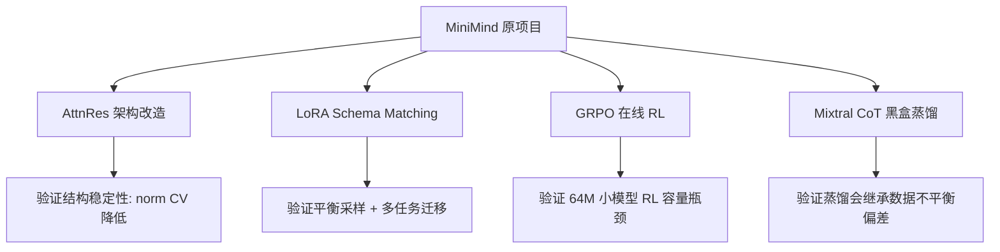

# 第四阶段：个人改造与实验面试笔记

> 目标：把个人改造讲成“我发现了什么问题、为什么这样设计、怎么改代码、怎么做对照实验、结果说明什么”。这一阶段是面试里最能体现主动性和工程判断的部分。

第四阶段包含四个主线：

1. AttnRes 架构改造：验证 Attention Residuals 是否缓解 PreNorm hidden state dilution。
2. LoRA Schema Matching：针对结构化字段匹配任务，解决极端类别不平衡和稀少正例问题。
3. GRPO 退化组实验：验证 64M 小模型在线 RL 的容量瓶颈。
4. 黑盒蒸馏失败案例：证明强 teacher + CoT 也会继承数据分布偏差。

整体关系如下：



面试总述：

> 我在 MiniMind 基础上做了四类个人实验。第一类是结构层面的 AttnRes 改造，用可学习历史层加权残差替代固定残差累加，验证了 hidden norm 更均匀；第二类是 LoRA Schema Matching，用平衡采样和 SM+EM 多任务迁移解决稀少正例问题；第三类是 GRPO 在线 RL，跑通后发现 64M 模型 reward 有上升但推理质量退化，说明小模型存在 RL 容量瓶颈；第四类是 Mixtral CoT 黑盒蒸馏，速度保持很好但 F1=0，证明蒸馏会继承数据不平衡偏差。

---

## 1. AttnRes 架构改造

### 1.1 整体概况

AttnRes 是你对 `model/model_minimind.py` 的结构改造。你没有直接改原文件，而是新建：

```text
model/model_minimind_attnres.py
```

原始 MiniMind 的 Transformer Block 是标准 PreNorm 残差：

```text
residual = hidden_states
attention_output = Attention(RMSNorm(hidden_states))
hidden_states = residual + attention_output
hidden_states = hidden_states + MLP(RMSNorm(hidden_states))
```

AttnRes 的变化是：Attention 子层后的 residual 不再只来自上一层 `h_{l-1}`，而是来自历史 hidden states 的可学习 softmax 加权和。

```text
Standard residual:
residual = h_{l-1}

AttnRes:
residual = sum(alpha_i * h_i)
alpha = softmax(score_i)
```

### 1.2 为什么要做

标准 PreNorm Transformer 有一个常见问题：hidden state 的范数可能随着层数加深不断累积。

标准残差：

```text
h_l = h_{l-1} + f_l(RMSNorm(h_{l-1}))
```

每层都固定把上一层完整加回来，残差权重恒为 1。层数加深后，hidden state norm 容易单调增长，早期层的有效贡献被后续大范数状态稀释。这就是你在实验里说的 `PreNorm Dilution`。

AttnRes 的目标是让模型自己学习：

```text
当前层应该从哪些历史层取 residual 信息
```

而不是永远固定使用上一层。

### 1.3 代码实现

原始代码在 `model/model_minimind.py`：

```python
residual = hidden_states
hidden_states, present_key_value = self.self_attn(...)
hidden_states += residual
hidden_states = hidden_states + self.mlp(...)
```

AttnRes 版本在 `model/model_minimind_attnres.py` 中增加了每层一个可学习 query：

```python
self.attn_res_query = nn.Parameter(torch.zeros(config.hidden_size))
```

如果 `hidden_size=768`、`num_layers=8`，额外参数量是：

```text
768 * 8 = 6144
```

约 6.1K，几乎不增加模型规模。

核心计算：

```python
stacked = torch.stack(prev_hiddens, dim=0)          # [L, B, S, H]
keys = stacked.mean(dim=2)                          # [L, B, H]
scores = torch.einsum('h,lbh->lb', self.attn_res_query, keys)
weights = torch.softmax(scores, dim=0)              # [L, B]
residual = torch.einsum('lb,lbsh->bsh', weights, stacked)
```

维度解释：

- `prev_hiddens`：进入当前层之前所有历史 hidden states。
- `stacked`：堆叠成 `[历史层数, batch, seq, hidden]`。
- `keys`：对 seq 维做 mean pooling，得到每层的全局表示。
- `scores`：每个历史层一个分数。
- `weights`：对历史层维度 softmax。
- `residual`：历史层 hidden states 的加权和。

在 `MiniMindModel.forward()` 中，需要维护历史状态：

```python
prev_hiddens = []
for layer, past_key_value in zip(self.layers, past_key_values):
    prev_hiddens.append(hidden_states)
    hidden_states, present = layer(..., prev_hiddens=prev_hiddens)
```

注意：你的实现只替换了 Attention 子层的 residual，MLP 子层仍然保持标准残差：

```python
hidden_states = residual + h_attn
hidden_states = hidden_states + self.mlp(...)
```

这是一个好设计，因为变量少，方便和标准残差做对照实验。

### 1.4 实验设计

实验脚本：

```text
experiments/attnres/run_comparison.py
experiments/attnres/plot_results.py
```

对照设置：

| 项目 | 配置 |
|---|---|
| 数据 | `sft_compare_10k.jsonl` |
| 模型 | 标准 residual vs AttnRes |
| hidden size | 512 |
| layers | 6 |
| batch size | 16 |
| max seq len | 256 |
| lr | 3e-4 |
| epochs | 5 |
| seed | 42 |

记录指标：

1. 每隔 20 step 记录 training loss。
2. 每个 epoch 结束记录各层 hidden state L2 norm。
3. 绘制 loss 曲线和 layer norm 对比图。

结果文件：

```text
experiments/attnres/metrics.jsonl
experiments/attnres/loss_comparison.png
experiments/attnres/layer_norm_comparison.png
```

### 1.5 实验结果

Loss 对比：

| 模型 | 最终 loss | 相对提升 |
|---|---:|---:|
| 标准残差 | 1.2204 | - |
| AttnRes | 1.2095 | +0.9% |

Hidden norm 对比：

| 模型 | L0 到 L5 norm | CV |
|---|---|---:|
| 标准残差 | 12 -> 17 -> 21 -> 26 -> 32 -> 40 | 0.368 |
| AttnRes | 16 -> 20 -> 21 -> 26 -> 26 -> 22 | 0.153 |

CV 是变异系数：

```text
CV = std / mean
```

CV 越低，说明各层 hidden norm 越均匀。

你的结果：

```text
0.368 -> 0.153
```

下降约 58%。

所以结论是：

```text
loss 只小幅提升，但 hidden state 层间稳定性明显改善
```

### 1.6 面试串讲版

> 我在 MiniMind 上复现了 Attention Residuals 的思想，目标是缓解 PreNorm Transformer 中 hidden state 随深度累积、早期层贡献被稀释的问题。原始 MiniMind 的残差连接是固定的 `h_l = h_{l-1} + f(h_{l-1})`，我改成了对所有历史 hidden states 做 softmax 加权。实现上，每层增加一个 `attn_res_query`，用它和历史层 hidden 的 sequence mean pooling 表示计算 score，再对历史层维度做 softmax，得到加权 residual。
>
> 实验上，我新建 `model_minimind_attnres.py`，用相同数据、相同 seed、相同配置训练标准残差和 AttnRes 两个模型。最终 AttnRes loss 从 1.2204 降到 1.2095，提升约 0.9%；更关键的是各层 hidden norm 的 CV 从 0.368 降到 0.153，说明它显著缓解了层间输出不均匀的问题。

### 1.7 高频追问

Q：loss 只提升 0.9%，这个实验有意义吗？  
A：有。AttnRes 的核心价值不是短训练下 loss 大幅下降，而是改善层间 hidden state 的稳定性。CV 从 0.368 降到 0.153，说明各层 norm 更均匀，验证了缓解 PreNorm dilution 的目标。

Q：为什么用 softmax？  
A：softmax 让历史层权重归一化，避免再次变成无限累加，同时允许模型选择性关注历史层。

Q：增加多少参数？  
A：每层一个 `hidden_size` 维 query。768 hidden、8 层时增加 6144 个参数，约 6.1K。

---

## 2. LoRA Schema Matching

### 2.1 整体概况

Schema Matching 任务是判断两个结构化字段是否语义等价。

示例：

```text
Attribute A:
name = customer_id
description = unique identifier for customer

Attribute B:
name = client_id
description = unique identifier for client

问题：这两个属性是否语义等价？
输出：Yes / No
```

相关文件：

```text
experiments/lora_schema_matching/convert_jellyfish.py
experiments/lora_schema_matching/eval_sm.py
experiments/lora_schema_matching/f1_results.txt
experiments/lora_schema_matching/example_outputs.txt
```

你的实验目标：

```text
用 MiniMind + LoRA 适配结构化字段匹配任务
```

### 2.2 为什么要做

这个实验对应你的项目定位：面向结构化数据的轻量级 LLM。

大模型做 Schema Matching 成本高、吞吐慢；MiniMind 推理快，但原始 full_sft 对结构化匹配理解不足。LoRA 适合做这个任务适配：

- 不需要全量更新 64M 参数。
- 可以保留 full_sft 的通用对话能力。
- 每个结构化任务只保存一个小 adapter。
- 方便快速迭代数据方案。

### 2.3 最大难点：类别极度不平衡

Jellyfish SM 训练集：

```text
No:  84,133 条，约 99.7%
Yes:    212 条，约 0.3%
```

这会导致模型学到多数类捷径：

```text
一直预测 No，就能获得很低 loss
```

所以第一次直接用全量 SM 数据训练会失败：

```text
全预测 No，F1=0
```

这个结论非常重要：

> 失败不是 LoRA 本身不行，而是交叉熵在极端不平衡数据上会把模型推向多数类退化解。

### 2.4 数据转换

`convert_jellyfish.py` 把 Jellyfish 的 `instruction/input/output` 转成 MiniMind 的 `conversations` 格式：

```python
user_content = item["instruction"] + "\n" + item["input"]

out = {
    "conversations": [
        {"role": "user", "content": user_content},
        {"role": "assistant", "content": item["output"]}
    ]
}
```

这样可以直接复用 MiniMind 的 `SFTDataset` 和 `train_lora.py`。

### 2.5 四次实验过程

第一次：全量 SM 直接训练，失败。

```text
数据：84,345 条，No 占 99.7%
结果：全预测 No，F1=0
原因：多数类捷径
```

第二次：只用 SM 做 1:1 平衡，仍失败。

```text
数据：212 Yes + 212 No = 424 条
结果：训练步数太少，LoRA 没学到稳定特征
原因：正例太少，总样本量太小
```

第三次：提高 rank 和训练轮数，部分成功。

```text
rank: 16 -> 64
训练轮数增加
结果：Precision 有改善，但仍不够
```

第四次：SM + EM 多任务联合训练，成功。

核心洞察：

```text
SM: Schema Matching，判断字段是否等价
EM: Entity Matching，判断实体是否等价
```

两者都是“给定两个对象，判断是否语义等价”的同构任务。EM 中正例更多，可以迁移等价判断能力。

最终数据：

```text
SM: 212 Yes + 212 No = 424
EM: 2000 Yes + 2000 No = 4000
合计: 4424 条，严格 1:1
```

最终设置：

```text
LoRA rank = 64
lr = 2e-4
20 epochs
约 1390 steps
```

### 2.6 评测设计

`eval_sm.py` 做了两件事：

1. 加载 `full_sft` base 模型。
2. 加载 `full_sft + LoRA` 模型。

LoRA 加载顺序：

```python
apply_lora(model, rank=LORA_RANK)
load_lora(model, LORA_WEIGHT)
```

先注入结构，再加载权重。

预测时：

```python
max_new_tokens = 16
do_sample = False
```

然后从输出里提取第一个 `Yes` 或 `No`。

指标把 `Yes` 当正类：

```text
Precision = 预测 Yes 中真正 Yes 的比例
Recall = 真实 Yes 中被找出的比例
F1 = Precision 和 Recall 的调和平均
```

### 2.7 结果解释

平衡测试集结果：

| 模型 | Precision | Recall | F1 | Accuracy |
|---|---:|---:|---:|---:|
| full_sft base | 0.500 | 1.000 | 0.667 | 0.500 |
| LoRA SM+EM | 0.905 | 0.396 | 0.551 | 0.677 |

全量测试集结果：

| 模型 | Precision | Recall | F1 | Accuracy |
|---|---:|---:|---:|---:|
| full_sft base | 0.004 | 1.000 | 0.008 | 0.004 |
| LoRA SM+EM | 0.019 | 0.396 | 0.037 | 0.917 |

解释重点：

- 全量测试集极度不平衡，所以 Accuracy 容易误导。
- 平衡测试集更适合观察是否学会等价判断。
- LoRA SM+EM 的关键提升是 Precision 从 0.50 到 0.905。
- 这说明模型变得更保守，但预测等价时更可靠。

真实业务中，误匹配代价通常高，所以高 Precision 是有价值的。

### 2.8 面试串讲版

> 我在 MiniMind 上做了 Schema Matching 的 LoRA 适配实验。任务是给定两个结构化字段的 name 和 description，判断它们是否语义等价，输出 Yes 或 No。我先把 Jellyfish 数据转成 MiniMind 的 conversations 格式，然后基于 full_sft 训练 LoRA。
>
> 实验中我发现直接用全量 SM 数据会失败，因为训练集中 99.7% 是 No，交叉熵会让模型学到多数类捷径，全预测 No，F1=0。之后我尝试 1:1 平衡 SM 数据，但正例只有 212 条，训练步数太少，仍然不稳定。最终我引入 Entity Matching 数据，因为 EM 和 SM 都是语义等价判断任务，用 SM+EM 构造 4424 条 1:1 平衡数据，并把 LoRA rank 提到 64。最终在平衡测试集上 Precision 从 0.50 提升到 0.905，说明模型学到了比较可靠的等价判断能力。

### 2.9 高频追问

Q：为什么第一次全量训练失败？  
A：因为 No 占 99.7%，全预测 No 是交叉熵下的多数类捷径。

Q：为什么平衡 SM 后还不够？  
A：SM 正例只有 212 条，总样本量太少，LoRA 训练步数不足。

Q：为什么 EM 能迁移到 SM？  
A：两者都是语义等价判断任务，只是对象粒度不同。EM 提供了更多正例，能迁移等价判断能力。

---

## 3. GRPO 退化组实验

### 3.1 整体概况

这部分验证的是：

```text
64M MiniMind 是否能通过 GRPO 在线 RL 获得明显推理提升？
```

结论是：

```text
能跑通，reward 有上升趋势，但最终推理质量提升有限，甚至出现退化。
```

核心文件：

```text
trainer/train_grpo.py
experiments/PLAN.md
```

### 3.2 实验配置

记录配置：

| 项目 | 内容 |
|---|---|
| 数据 | 19,506 条 `rlaif` |
| 硬件 | 3 卡 4090 DDP |
| batch | `batch_size=1 x 3` |
| num_generations | 4 |
| max_gen_len | 512 |
| rollout_engine | torch |
| reward_model | InternLM2-1.8B-Reward |
| 训练进度 | step 3510 / 6501，约 54% |

当前代码默认 `num_generations=6`，但你的实际实验记录中使用的是 4。

### 3.3 核心代码

GRPO 的组内 advantage：

```python
grouped_rewards = rewards.view(-1, args.num_generations)
mean_r = grouped_rewards.mean(dim=1).repeat_interleave(args.num_generations)
std_r = grouped_rewards.std(dim=1).repeat_interleave(args.num_generations)
advantages = (rewards - mean_r) / (std_r + 1e-4)
```

含义：

```text
同一个 prompt 的多条回答组成一组
高于组平均 reward 的回答被鼓励
低于组平均 reward 的回答被抑制
```

再计算新旧策略概率比：

```python
ratio = torch.exp(per_token_logps - old_per_token_logps)
```

默认 `cispo` loss：

```python
clamped_ratio = torch.clamp(ratio, max=args.epsilon_high).detach()
per_token_loss = -(clamped_ratio * advantages.unsqueeze(1) * per_token_logps - args.beta * per_token_kl)
```

其中 `per_token_kl` 来自 ref model，防止模型偏离 `full_sft`。

### 3.4 实验现象

Reward 曲线：

| 阶段 | Reward | 含义 |
|---|---:|---|
| step 451 | -3.01 | 初始回复质量差 |
| step 1000 | 约 -1.5 | reward 有提升，偶有正分 |
| step 3510 | 约 -1.0，波动 | 趋势向上，但方差大 |

推理测试中出现的问题：

| 问题 | 现象 |
|---|---|
| `9.9 vs 9.11` 大小比较 | 答非所问 |
| `strawberry` 中 r 的个数 | 幻觉严重、重复输出 |
| 买鸡赚多少钱 | `<think>` 中重复“平衡”，陷入循环 |

这说明：

```text
reward 数值有改善，但没有稳定转化成推理能力
```

### 3.5 为什么退化

第一，模型容量不足。

GRPO 是在模型已有策略空间里做搜索和强化。如果模型本身无法稳定生成好答案，RL 很难凭空创造能力。

第二，reward 信号噪声大。

`rlaif` 是通用偏好数据，不是推理专项数据。InternLM2-1.8B-Reward 可能奖励格式、长度、流畅度，但未必真正奖励推理正确性。

第三，组内样本质量不足。

GRPO 依赖同一 prompt 下多条回答的质量差异。如果多条回答都差或很相似，组内标准差小，advantage 信号就弱。

第四，thinking 格式不稳定。

小模型学到了 `<think>` 形式，但没有足够能力维持长链条推理，容易重复。

### 3.6 负结论的价值

这个实验的价值不在于“GRPO 训出了强推理”，而在于你证明了：

```text
在线 RL 对小模型不是万能的
模型基础能力、reward 质量、rollout 多样性是前提
```

可以把它和 DPO 对比：

| 维度 | DPO | GRPO |
|---|---|---|
| 数据 | chosen/rejected 静态偏好对 | 在线生成 |
| 稳定性 | 更稳定 | 更不稳定 |
| reward model | 不需要 | 需要 |
| 依赖采样质量 | 较低 | 很高 |
| 64M 上表现 | loss 明显下降 | reward 上升但能力不稳 |

### 3.7 面试串讲版

> 我在 MiniMind 上跑通了 GRPO，用 RLAIF 数据和 InternLM2-1.8B-Reward，每个 prompt 采样 4 条回复，用组内 reward 标准化得到 advantage。代码上核心是把 rewards reshape 成 `[batch, num_generations]`，计算组内 mean/std，再用 `(reward-mean)/std` 作为优势值，配合 policy logprob、KL penalty 和 CISPO loss 更新模型。
>
> 实验结果是 reward 从 -3.01 提升到约 -1.0，说明训练信号存在；但推理测试仍出现答非所问、幻觉和 `<think>` 重复循环。我的结论是：GRPO 对 64M 小模型收益有限，瓶颈在模型容量、reward 噪声和 rollout 多样性。这个负结论说明小模型更适合通过 SFT、LoRA 和高质量数据直接注入能力，而不是过早依赖在线 RL。

### 3.8 高频追问

Q：reward 上升了，为什么推理仍差？  
A：reward model 可能奖励表面质量，不等价于真实推理正确。reward 提升不一定转化成任务能力。

Q：什么是组退化？  
A：同组多条回答都差或相似，reward 差异小，advantage 信号弱，训练变成噪声。

Q：这个实验失败了吗？  
A：不是失败，而是有价值的负结论，说明小模型在线 RL 有容量和探索瓶颈。

---

## 4. 黑盒蒸馏失败案例

### 4.1 整体概况

这部分实验是：

```text
Mixtral-8x7B CoT -> MiniMind-64M
```

类型是黑盒蒸馏，因为学生只能看到 teacher 生成的文本，看不到 logits。

相关文件：

```text
experiments/distillation/prepare_distill_data.py
experiments/distillation/speed_benchmark.py
experiments/distillation/speed_results.txt
experiments/PLAN.md
```

### 4.2 为什么做黑盒蒸馏

目标是验证：

```text
能不能把 Mixtral-8x7B 的结构化推理链能力压缩到 MiniMind-64M？
```

如果成功，MiniMind 可以作为高速判别节点：

- 速度快。
- 成本低。
- 参数少。
- 可接入多智能体系统。

### 4.3 为什么不能白盒蒸馏

白盒蒸馏需要对齐 teacher/student logits：

```text
KL(student_logits, teacher_logits)
```

但 Mixtral/Jellyfish 和 MiniMind tokenizer 不兼容。MiniMind 是 6400 词表，而外部大模型词表不同，logits 维度和 token 含义都无法逐维对齐。

所以只能使用黑盒方案：

```text
学习 teacher 生成出来的文本
```

### 4.4 数据构造

数据来自：

```text
with_generated_reasoning/sm_gen_m8x7b.jsonl
```

共 84,345 条，`output` 是 Mixtral 生成的推理链和 Yes/No 结论。

转换逻辑：

```python
user_content = item["instruction"] + "\n" + item["input"]

out = {
    "conversations": [
        {"role": "user", "content": user_content},
        {"role": "assistant", "content": item["output"]}
    ]
}
```

本质上是：

```text
teacher output 作为 SFT target
```

### 4.5 训练和速度结果

训练配置：

```text
数据：84,345 条 Mixtral CoT
epochs：2
batch_size：32
lr：1e-5
steps：5,272
```

Loss：

| 阶段 | Loss |
|---|---:|
| Epoch 1 开始 | 0.701 |
| Epoch 1 结束 | 0.345 |
| Epoch 2 结束 | 0.287 |

速度：

| 模型 | 速度 |
|---|---:|
| full_sft | 178.9 ± 1.4 tokens/s |
| distill_sft | 173.6 ± 5.1 tokens/s |
| Jellyfish-7B | 约 30-50 tokens/s |

结论：

```text
蒸馏后 MiniMind 仍保持约 174 tokens/s
速度目标达到了
```

### 4.6 F1=0 的失败原因

SM 平衡测试集结果：

| 方案 | Precision | Recall | F1 | Accuracy | 说明 |
|---|---:|---:|---:|---:|---|
| full_sft base | 0.500 | 1.000 | 0.667 | 0.500 | 全预测 Yes |
| LoRA SM+EM | 0.905 | 0.396 | 0.551 | 0.677 | 平衡+迁移有效 |
| distill_sft | 0.000 | 0.000 | 0.000 | 1.000 | 全预测 No |

核心原因：

```text
黑盒蒸馏使用全量 84K SM 数据
其中 99.7% 标签是 No
Mixtral 生成的推理链大多数结论也是 No
MiniMind 学到的是“生成 No 推理”
而不是“判断语义等价性”
```

一句话：

> 黑盒蒸馏把数据不平衡问题也蒸馏进了模型。

### 4.7 和 LoRA SM 的联系

这两个实验正好互相印证：

```text
LoRA SM 全量数据 -> 全预测 No -> F1=0
黑盒蒸馏全量 CoT -> 全预测 No -> F1=0
LoRA SM+EM 平衡迁移 -> Precision 0.905
```

所以结论不是“需要更强 teacher”，而是：

```text
需要先解决数据分布
```

对稀少正例任务来说：

- 平衡采样很关键。
- 同构任务迁移很关键。
- 盲目增加 teacher 生成数据可能会放大偏差。

### 4.8 面试串讲版

> 我做过一个黑盒蒸馏实验，用 Jellyfish 中 Mixtral-8x7B 生成的 Schema Matching 推理链作为 teacher 输出，把 84K 条数据转成 MiniMind 的 SFT 格式继续训练。速度结果很好，MiniMind 蒸馏后仍然有约 174 tokens/s，明显快于 7B 模型。
>
> 但下游 SM 评测失败了，F1=0，模型全预测 No。深入分析后我发现原因不是蒸馏代码问题，而是数据分布问题：SM 数据 99.7% 是 No，Mixtral 生成的推理链大多数也是 No，因此 MiniMind 学到的是“生成 No 推理”的模式，而不是语义等价判断能力。这个失败案例验证了我在 LoRA SM 实验中的结论：结构化匹配任务的根本难点是稀少正例和类别不平衡，解决方案应该是平衡采样和同构任务迁移，而不是单纯引入更强 teacher 或更多 CoT。

### 4.9 高频追问

Q：黑盒蒸馏和白盒蒸馏区别？  
A：黑盒只能看到 teacher 生成文本，本质接近 SFT；白盒能看到 teacher logits，用 KL 拟合 teacher 分布。

Q：loss 降到 0.287，为什么 F1 还是 0？  
A：loss 说明模型拟合了训练分布，而训练分布 99.7% 是 No。模型很好地学会了多数类模式，所以 F1 仍然为 0。

Q：这个实验失败了吗？  
A：能力目标失败，但实验有价值。它证明蒸馏会继承数据偏差，也说明平衡采样比单纯增加 CoT 更关键。

---

## 5. 第四阶段总串讲

面试时可以这样把四个实验串起来：

> 我在 MiniMind 上做了四类个人实验。第一类是架构实验，我实现了 AttnRes，用可学习历史层 softmax 加权残差替代固定残差，在相同配置下 loss 小幅下降 0.9%，但 hidden norm CV 从 0.368 降到 0.153，说明缓解了 PreNorm 层间输出不均匀问题。
>
> 第二类是结构化数据适配实验，我把 Jellyfish Schema Matching 转成 MiniMind SFT 格式，用 LoRA 适配 full_sft。实验发现全量 SM 数据 99.7% 是 No，会导致模型全预测 No。最终通过 SM+EM 1:1 平衡多任务训练，把平衡测试集 Precision 从 0.50 提升到 0.905。
>
> 第三类是在线 RL 实验，我跑通 GRPO，但发现 64M 模型 reward 虽然从 -3.01 提升到约 -1.0，推理仍不稳定，出现 hallucination 和 `<think>` 循环。这说明小模型在线 RL 高度依赖基础容量、reward 质量和 rollout 多样性。
>
> 第四类是黑盒蒸馏实验，我用 Mixtral-8x7B CoT 蒸馏 MiniMind，速度保持在约 174 tokens/s，但 SM F1=0。原因是蒸馏数据 99.7% 是 No，模型把类别不平衡也学进去了。这个实验进一步证明结构化匹配任务的核心不是 teacher 够不够强，而是数据分布和正例构造。

---

## 6. 第四阶段自检清单

- [ ] 能解释 AttnRes 为什么针对 PreNorm hidden state dilution。
- [ ] 能写出 AttnRes 的 `residual = sum(alpha_i * h_i)`。
- [ ] 能解释 AttnRes 为什么 CV 比 loss 更能体现效果。
- [ ] 能解释 Schema Matching 的任务定义。
- [ ] 能解释为什么 99.7% No 会导致多数类捷径。
- [ ] 能解释为什么 EM 可以迁移到 SM。
- [ ] 能解释 LoRA SM+EM 为什么 Precision 高但 Recall 不高。
- [ ] 能解释 GRPO 为什么在 64M 上 reward 上升但能力不稳。
- [ ] 能解释什么是组退化。
- [ ] 能解释黑盒蒸馏为什么 F1=0。
- [ ] 能解释为什么 Mixtral 不能直接做白盒 logits 蒸馏。

---

## 7. 面试高频问题速答

**Q：你这个项目里最有个人贡献的地方是什么？**  
A：我不只是跑通 MiniMind 原训练链路，还做了结构改造和任务适配实验。比如 AttnRes 复现验证、LoRA Schema Matching、GRPO 小模型容量实验，以及 Mixtral CoT 黑盒蒸馏失败分析。

**Q：AttnRes 的实验结论是什么？**  
A：loss 提升约 0.9%，但 hidden norm CV 从 0.368 降到 0.153，说明它显著改善了层间 hidden state 不均匀问题。

**Q：LoRA Schema Matching 的关键是什么？**  
A：关键不是 LoRA 本身，而是解决 99.7% No 的类别不平衡。最终通过 SM+EM 1:1 平衡多任务迁移，Precision 提升到 0.905。

**Q：GRPO 负结论怎么讲？**  
A：GRPO 能跑通，reward 有提升，但 64M 模型推理质量不稳定。这说明在线 RL 依赖模型基础容量和 reward 质量，小模型更适合先用 SFT/LoRA 注入能力。

**Q：蒸馏为什么失败？**  
A：因为黑盒蒸馏忠实学习 teacher output 的分布，而 teacher 数据 99.7% 是 No，模型学到了全预测 No。失败原因是类别不平衡被蒸馏进模型。

